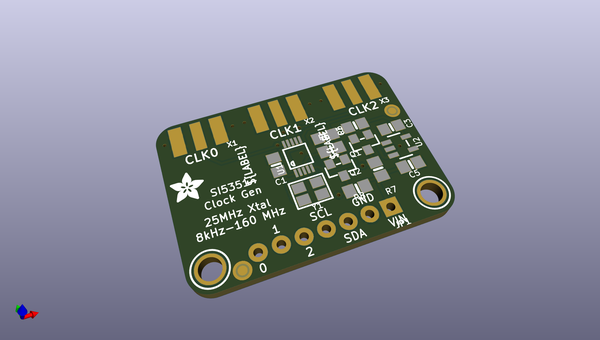
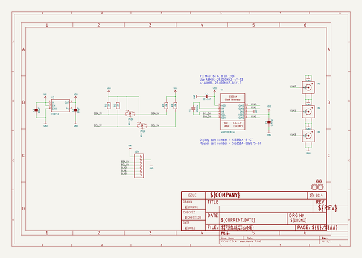
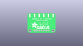
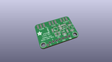
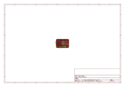
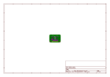
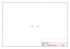
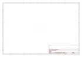
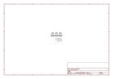

# OOMP Project  
## Adafruit-Si5351A-Clock-Generator-Breakout-PCB  by adafruit  
  
oomp key: oomp_projects_flat_adafruit_adafruit_si5351a_clock_generator_breakout_pcb  
(snippet of original readme)  
  
-- Adafruit Si5351A Clock Generator Breakout PCB  
<a href="http://www.adafruit.com/products/2045">   
Click here to purchase one from the Adafruit shop</a>  
  
Never hunt around for another crystal again, with the Si5351A clock generator breakout from Adafruit! This chip has a precision 25MHz crystal reference and internal PLL and dividers so it can generate just about any frequency, from <8KHz up to 150+ MHz.  
  
The Si5351A clock generator is an I2C controller clock generator. It uses the onboard precision clock to drive multiple PLL's and clock dividers using I2C instructions. By setting up the PLL and dividers you can create precise and arbitrary frequencies. There are three independent outputs, and each one can have a different frequency. Outputs are 3Vpp, either through a breadboard-friendly header or, for RF work, an optional SMA connector.  
  
We put this handy little chip onto it's own breakout board PCB, with a 3.3V LDO regulator so it can be powered from 3-5VDC. We also put level shifting circuitry on the I2C lines so you can use this chip safely with 3V or 5V logic.  
  
PCB files for the Adafruit Si5351A Clock Generator Breakout. The format is EagleCAD schematic and board layout  
- http://www.adafruit.com/product/2045  
  
--- License  
  
Adafruit invests time and resources providing this open source design, please support Adafruit and open-source hardware by purchasing products from [Adafruit](https://www.adafruit.com)!  
  
All text a  
  full source readme at [readme_src.md](readme_src.md)  
  
source repo at: [https://github.com/adafruit/Adafruit-Si5351A-Clock-Generator-Breakout-PCB](https://github.com/adafruit/Adafruit-Si5351A-Clock-Generator-Breakout-PCB)  
## Board  
  
  
## Schematic  
  
  
  
[schematic pdf](working_schematic.pdf)  
## Images  
  
  
  
  
  
  
  
  
  
  
  
  
  
  
  
  
