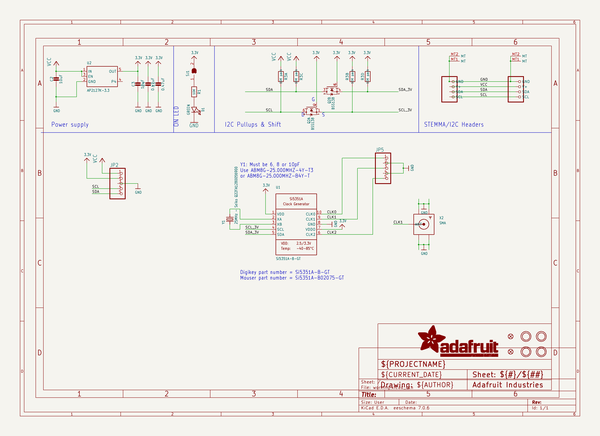
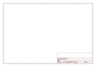

# OOMP Project  
## Adafruit-Si5351A-Clock-Generator-with-STEMMA-QT-PCB  by adafruit  
  
(snippet of original readme)  
  
-- Adafruit Adafruit Si5351A Clock Generator with STEMMA QT 8KHz to 160MHz PCB  
  
<a href="http://www.adafruit.com/products/5640">   
Click here to purchase one from the Adafruit shop</a>  
  
PCB files for the Adafruit Adafruit Si5351A Clock Generator with STEMMA QT 8KHz to 160MHz.   
  
Format is EagleCAD schematic and board layout  
* https://www.adafruit.com/product/5640  
  
--- Description  
  
Never hunt around for another crystal again, with the Si5351A clock generator breakout from Adafruit! This chip has a precision 25MHz crystal reference and internal PLL and dividers so it can generate just about any frequency, from <8KHz up to 150+ MHz.  
  
The Si5351A clock generator is an I2C controller clock generator. It uses the onboard precision clock to drive multiple PLL's and clock dividers using I2C instructions. By setting up the PLL and dividers you can create precise and arbitrary frequencies. There are three independent outputs, and each one can have a different frequency. Outputs are 3Vpp, either through a breadboard-friendly header or, for RF work, an optional edge-launch SMA connector for output -1. (If you need SMA-connector outputs for all three ports, check out the non-QT breakout here)  
  
To get you going fast, we spun up a custom-made PCB in the STEMMA QT form factor, making it easy to interface with. The STEMMA QT connectors on either side are compatible with the SparkFun Qwiic I2C connectors. This allows you to make solderless co  
  full source readme at [readme_src.md](readme_src.md)  
  
source repo at: [https://github.com/adafruit/Adafruit-Si5351A-Clock-Generator-with-STEMMA-QT-PCB](https://github.com/adafruit/Adafruit-Si5351A-Clock-Generator-with-STEMMA-QT-PCB)  
## Board  
  
  
## Schematic  
  
  
  
[schematic pdf](working_schematic.pdf)  
## Images  
  
  
  
  
  
  
  
  
  
  
  
  
  
  
  
  
