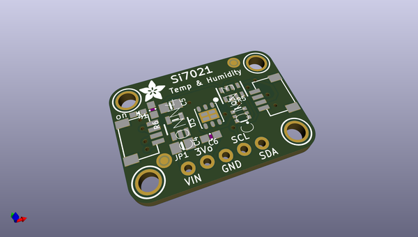
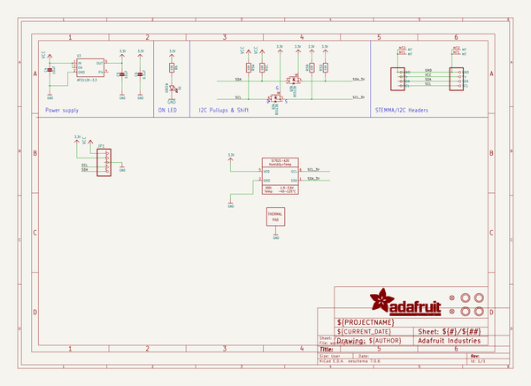

# OOMP Project  
## Adafruit-Si7021-PCB  by adafruit  
  
oomp key: oomp_projects_flat_adafruit_adafruit_si7021_pcb  
(snippet of original readme)  
  
-- Adafruit Si7021 Temperature & Humidity Sensor Breakout PCB  
<a href="http://www.adafruit.com/products/3251">   
Click here to purchase one from the Adafruit shop</a>  
  
It's summer and you're sweating and your hair's all frizzy and all you really want to know is why the weatherman said this morning that today's relative humidity would max out at a perfectly reasonable 42% when it feels more like 77%. Enter the Si7021 Temperature + Humidity Sensor - the best way to prove the weatherman wrong!  
  
This lovely sensor for Silicon labs has ± 3% relative humidity measurements with a range of 0–80% RH, and ±0.4 °C temperature accuracy at a range of -10 to +85 °C. Great for all of your environmental sensing projects. It uses I2C for data transfer so it works with a wide range of microcontrollers.  
  
To get you going fast, we spun up a custom made PCB in the STEMMA QT form factor, making them easy to interface with. The STEMMA QT connectors on either side are compatible with the SparkFun Qwiic I2C connectors. This allows you to make solderless connections between your development board and the LIS331s or to chain them with a wide range of other sensors and accessories using a compatible cable. We’ve of course broken out all the pins to standard headers and added a voltage regulator and level shifting so allow you to use it with either 3.3V or 5V systems such as the Raspberry Pi + Feather series or Arduino Uno respectively.  
  
PCB files for   
  full source readme at [readme_src.md](readme_src.md)  
  
source repo at: [https://github.com/adafruit/Adafruit-Si7021-PCB](https://github.com/adafruit/Adafruit-Si7021-PCB)  
## Board  
  
  
## Schematic  
  
  
  
[schematic pdf](working_schematic.pdf)  
## Images  
  
  
  
  
  
  
  
  
  
  
  
  
  
  
  
  
