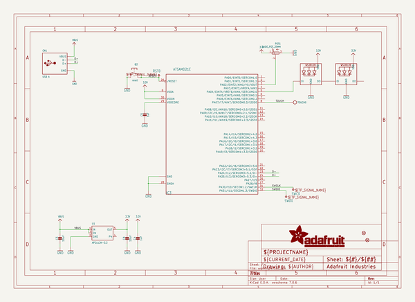
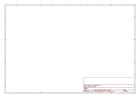

# OOMP Project  
## Adafruit-Slider-Trinkey-PCB  by adafruit  
  
oomp key: oomp_projects_flat_adafruit_adafruit_slider_trinkey_pcb  
(snippet of original readme)  
  
-- Adafruit Slider Trinkey PCB  
  
<a href="http://www.adafruit.com/products/5021">   
Click here to purchase one from the Adafruit shop</a>  
  
PCB files for the Adafruit Slider Trinkey.   
  
Format is EagleCAD schematic and board layout  
* https://www.adafruit.com/product/5021  
  
--- Description  
  
It's half USB Key, half Adafruit Trinket, half mini slide pot... it's Slider Trinkey, the circuit board with a Trinket M0 heart, NeoPixel glow, and a 35mm long 10KΩ slide potentiometer.  
  
The PCB is designed to slip into any USB A port on a computer or laptop. There's an ATSAMD21 microcontroller on board with just enough circuitry to keep it happy. One pin of the microcontroller connects to the middle of the slide potentiometer as an analog input. Another connects to two NeoPixel LEDs. The third pin can be used as a capacitive touch input. A reset button lets you enter bootloader mode if necessary. That's it!  
  
The SAMD21 can run CircuitPython or Arduino very nicely - with existing NeoPixel and our FreeTouch libraries for the capacitive touch input. Over the USB connection, you can have serial, MIDI, or HID connectivity. The Slider Trinkey is perfect for simple projects that can use a few user inputs and colorful output. Maybe you'll set it up as a monitor brightness adjuster, or volume control, or color picker.  
  
Please note this board DOES come with a pre-soldered slide pot (there's really only one that fits and we happen to stock it) Since we  
  full source readme at [readme_src.md](readme_src.md)  
  
source repo at: [https://github.com/adafruit/Adafruit-Slider-Trinkey-PCB](https://github.com/adafruit/Adafruit-Slider-Trinkey-PCB)  
## Board  
  
  
## Schematic  
  
  
  
[schematic pdf](working_schematic.pdf)  
## Images  
  
  
  
  
  
  
  
  
  
  
  
  
  
  
  
  
