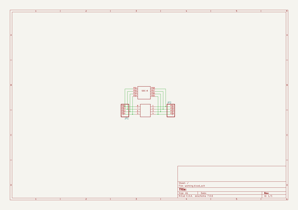

# OOMP Project  
## Adafruit-SMT-Breakout-PCBs  by adafruit  
  
(snippet of original readme)  
  
-- Adafruit SMT Breakout PCBs  
<a href="http://www.adafruit.com/products/1377">   
Click here to purchase one from the Adafruit shop</a>  
  
Beguiled by a fancy new chip that is only available in a strange pinout? These breakout PCBs will make your life much much easier and get you prototyping faster than ever.  
  
All the basic SMT breakouts are here!  
  
For more details, check out the product pages at  
  
  * https://www.adafruit.com/products/1377 (48-pin)  
  * https://www.adafruit.com/products/1162 (44-pin)  
  * https://www.adafruit.com/products/1163 (32-pin)  
  * https://www.adafruit.com/products/1208 (28-pin)  
  * https://www.adafruit.com/products/1206 (20-pin)  
  * https://www.adafruit.com/products/1207 (16-pin)  
  * https://www.adafruit.com/products/1210 (14-pin)  
  * https://www.adafruit.com/products/1211 (12-pin)  
  * https://www.adafruit.com/products/1212 (8-pin)  
  * https://www.adafruit.com/products/1230 (SOT & TO252 set)  
  * https://www.adafruit.com/product/1762 (5050 LED)  
  * https://www.adafruit.com/product/1863 (JST 2-PH w/switch)  
  * https://www.adafruit.com/products/1862 (JST 2-PH)  
  * https://www.adafruit.com/products/1868 (12mm coin)  
  * https://www.adafruit.com/products/1867 (12mm coin w/switch)  
  * https://www.adafruit.com/products/1870 (20mm coin)  
  * https://www.adafruit.com/products/1871 (20mm coin w/switch)  
  * https://www.adafruit.com/products/1833 (micro B)  
  * https://www.adafruit.com/products/1764 (mini B)  
  * http  
  full source readme at [readme_src.md](readme_src.md)  
  
source repo at: [https://github.com/adafruit/Adafruit-SMT-Breakout-PCBs](https://github.com/adafruit/Adafruit-SMT-Breakout-PCBs)  
## Board  
  
  
## Schematic  
  
  
  
[schematic pdf](working_schematic.pdf)  
## Images  
  
  
  
  
  
  
  
  
  
  
  
  
  
  
  
  
