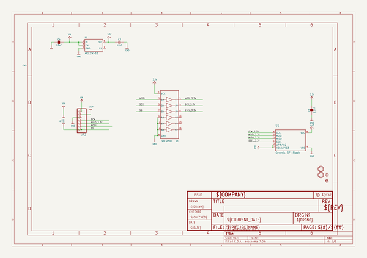

# OOMP Project  
## Adafruit-SPI-Flash-Breakout-PCB  by adafruit  
  
oomp key: oomp_projects_flat_adafruit_adafruit_spi_flash_breakout_pcb  
(snippet of original readme)  
  
-- Adafruit SPI Flash Breakouts  
  
&nbsp;   
   
&nbsp;   
  
Click to purchase from the Adafruit Shop:  
- [Adafruit SPI FLASH Breakout - W25Q16 - 16 Mbit / 2 MByte](https://www.adafruit.com/product/5635)  
- [Adafruit SPI FLASH Breakout - W25Q64 - 64 MBit / 8 MByte](https://www.adafruit.com/product/5636)  
- [Adafruit SPI FLASH Breakout W25Q128 - 128 MBit / 16 MByte](https://www.adafruit.com/product/5643)  
  
PCB files for the Adafruit SPI Flash Breakouts.   
  
Format is EagleCAD schematic and board layout  
  
--- Description  
  
Sometimes you need a little extra storage for your microcontroller projects: for files, images, fonts, audio clips, etc. If you need lots of space, like in the gigabytes, we always recommend an SD card because you can easily plug it into a computer to edit files. But sometimes you don't need whole gigabytes, you just need a megabyte or two, with the lower cost and power usage that comes with it. That's when we recommend an Adafruit SPI FLASH Breakout such as this one that is fitted with a W25Q16 - 16 Mbit / 2 MByte, W25Q64 - 64 Mbit / 8 MByte or W25Q128 - 128 Mbit / 16 MByte chip.  
  
Compared to our QSPI breakouts, this one is single-channel SPI only...BUT it comes w  
  full source readme at [readme_src.md](readme_src.md)  
  
source repo at: [https://github.com/adafruit/Adafruit-SPI-Flash-Breakout-PCB](https://github.com/adafruit/Adafruit-SPI-Flash-Breakout-PCB)  
## Board  
  
  
## Schematic  
  
  
  
[schematic pdf](working_schematic.pdf)  
## Images  
  
  
  
  
  
  
  
  
  
  
  
  
  
  
  
  
