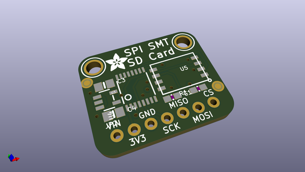
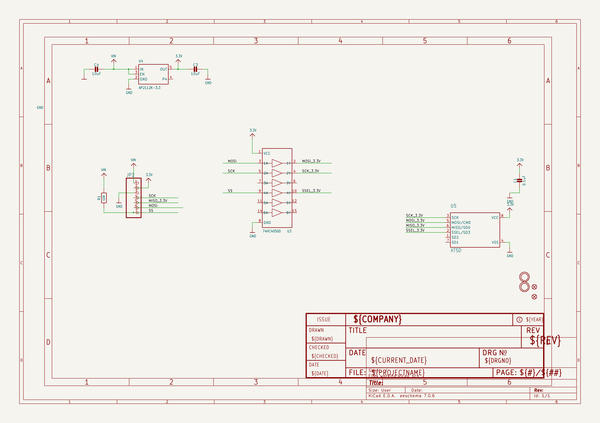
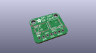
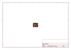
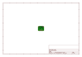
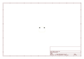
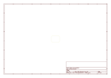
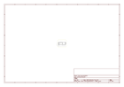

# OOMP Project  
## Adafruit-SPI-Flash-SD-Card-PCB  by adafruit  
  
(snippet of original readme)  
  
-- Adafruit SPI Flash SD Card PCB  
  
<a href="http://www.adafruit.com/products/4899">   
Click here to purchase one from the Adafruit shop</a>  
  
PCB files for the Adafruit SPI Flash SD Card.  
  
Format is EagleCAD schematic and board layout  
* https://www.adafruit.com/product/4899  
  
--- Description  
  
This breakout is for a fascinating chip - it looks like an SPI Flash storage chip (like the GD25Q16) but its really an SD card, in an SMT chip format. What that means is that you wire up like an SD card breakout, and use the SD card libraries you already have for your microcontroller. For example, you can use the built in SD library in Arduino, or for CircuitPython we have an sdcard library. The breakout will act just like a 512 MB sized card with FAT formatting (it's pre-formatted).  
  
You might be wondering why you'd want such a thing - after all you can't plug it into a computer to get the files off like MicroSD cards. For some use cases, such as data logging in a high-vibration device where you don't want the SD card to come loose, or for when you need to reduce size, or when the microcontroller provides a USB mass storage interface, this chip could very useful.  
  
Compared to plain SPI flash, this NAND memory chip handles all the wear leveling and ECC calculation. You don't have to manually erase blocks, you just write and read them like you would with any SD card.You can clock it up 50 MHz and the 'write speed class' is 8 (although you  
  full source readme at [readme_src.md](readme_src.md)  
  
source repo at: [https://github.com/adafruit/Adafruit-SPI-Flash-SD-Card-PCB](https://github.com/adafruit/Adafruit-SPI-Flash-SD-Card-PCB)  
## Board  
  
  
## Schematic  
  
  
  
[schematic pdf](working_schematic.pdf)  
## Images  
  
  
  
  
  
  
  
  
  
  
  
  
  
  
  
  
