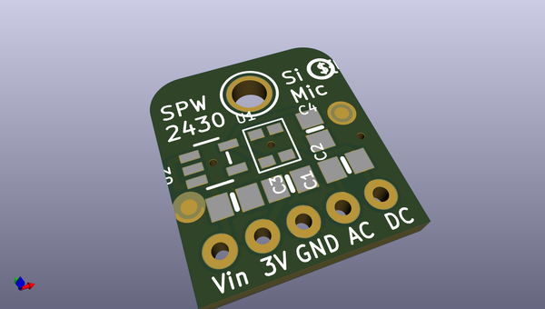
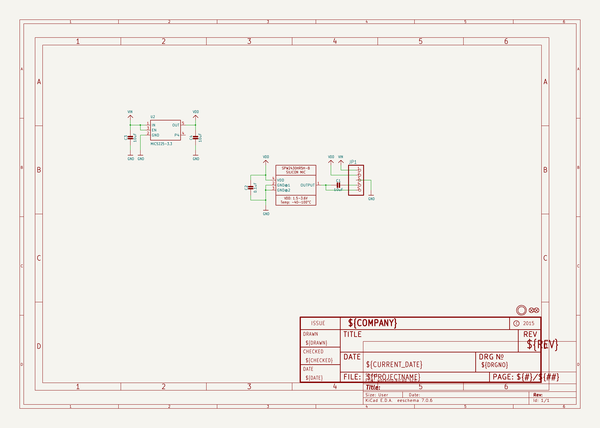
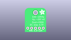
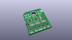
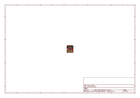
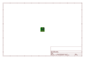
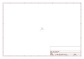
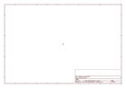
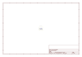

# OOMP Project  
## Adafruit-SPW2430-PCB  by adafruit  
  
(snippet of original readme)  
  
-- Adafruit Silicon MEMS Microphone Breakout SPW2430 PCB  
<a href="http://www.adafruit.com/products/2716">   
Click here to purchase one from the Adafruit shop</a>  
  
Listen to this good news - we now have a breakout board for a super tiny MEMS microphone. Just like 'classic' electret microphones, MEMS mics can detect sound and convert it to voltage, but they don't need a bias resistor or amplifier, its all in one! The SPW2430 is a small, low cost MEMS mic with a range of 100Hz - 10KHz, good for just about all general audio recording/detection.  
  
This breakout is best used for projects such as voice changers, audio recording/sampling, and audio-reactive projects that use FFT. To keep the breakout small and simple, we only added a 3V voltage regulator (the microphone requires 3.3V DC) and filter capacitors. No additional opamp is included, the output peak-to-peak voltage has a 0.67V DC bias and about 100mVpp (peak-to-peak) when talking near the microphone, which is good for attaching to something that expects 'line level' input without clipping. The peak-to-peak can be as high as 1Vpp if there's a very loud sound. If you are If you need a microphone with adjustable gain or auto-gain control, check out our mic+amplifier options. If you need a higher peak-to-peak, a rail-to-rail op-amp and some resistors can get you boosted up!  
  
Using it is simple: connect GND to ground, Vin to 3.3-5VDC. For the best performance, use the "quietest  
  full source readme at [readme_src.md](readme_src.md)  
  
source repo at: [https://github.com/adafruit/Adafruit-SPW2430-PCB](https://github.com/adafruit/Adafruit-SPW2430-PCB)  
## Board  
  
  
## Schematic  
  
  
  
[schematic pdf](working_schematic.pdf)  
## Images  
  
  
  
  
  
  
  
  
  
  
  
  
  
  
  
  
