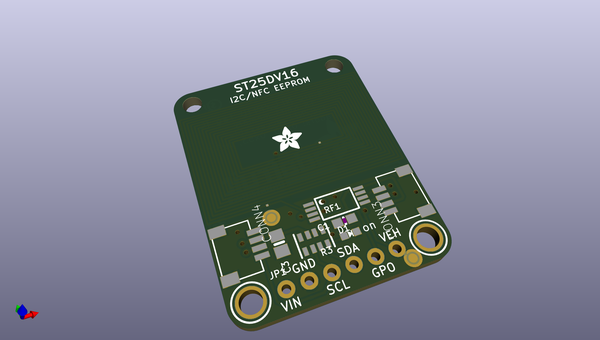
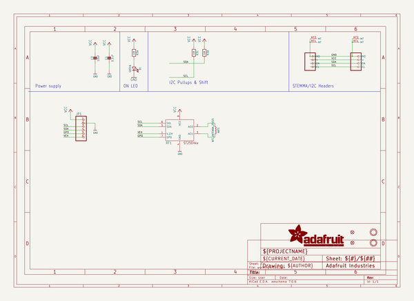
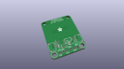
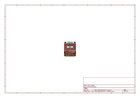
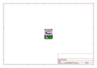
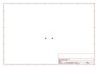
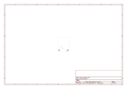
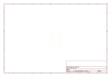

# OOMP Project  
## Adafruit-ST25DV16-PCB  by adafruit  
  
(snippet of original readme)  
  
-- Adafruit Adafruit ST25DV16K I2C RFID EEPROM Breakout - STEMMA QT / Qwiic PCB  
  
<a href="http://www.adafruit.com/products/4701">   
Click here to purchase one from the Adafruit shop</a>  
  
PCB files for the Adafruit Adafruit ST25DV16K I2C RFID EEPROM Breakout - STEMMA QT / Qwiic.   
  
Format is EagleCAD schematic and board layout  
* https://www.adafruit.com/product/4701  
  
--- Description  
  
This RFID tag is really unique: it works with mobile phones just like other RFID tags, but you can reprogram it over I2C. The tag shows up as an ISO/IEC 15693 (13.56MHz) chip which is readable by phones and tablets. This could be interesting in situations where you want a  tag that can be re-written dynamically when connected to a controller. For example, we did a test where we had a microcontroller write different URLs a few seconds apart, and the mobile phone detected the different URLs one after the other.  
  
--- License  
  
Adafruit invests time and resources providing this open source design, please support Adafruit and open-source hardware by purchasing products from [Adafruit](https://www.adafruit.com)!  
  
Designed by Kattni Rembor for Adafruit Industries.  
  
Creative Commons Attribution/Share-Alike, all text above must be included in any redistribution.   
See license.txt for additional details.  
  
  full source readme at [readme_src.md](readme_src.md)  
  
source repo at: [https://github.com/adafruit/Adafruit-ST25DV16-PCB](https://github.com/adafruit/Adafruit-ST25DV16-PCB)  
## Board  
  
  
## Schematic  
  
  
  
[schematic pdf](working_schematic.pdf)  
## Images  
  
  
  
  
  
  
  
  
  
  
  
  
  
  
  
  
