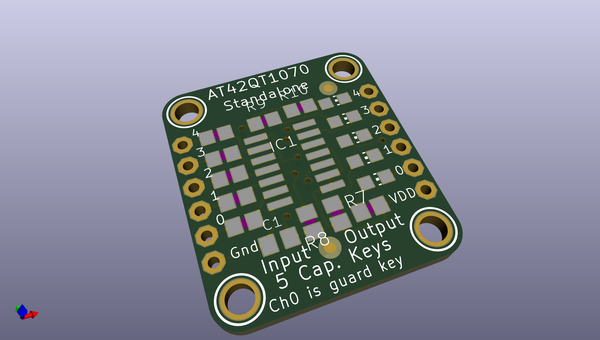
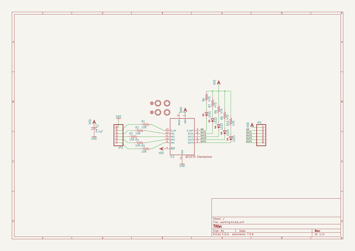
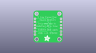
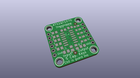
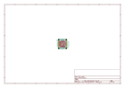
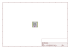
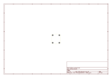
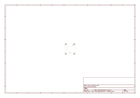
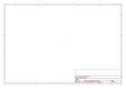
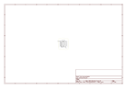

# OOMP Project  
## Adafruit-Standalone-Capacitive-Sensor-PCB  by adafruit  
  
oomp key: oomp_projects_flat_adafruit_adafruit_standalone_capacitive_sensor_pcb  
(snippet of original readme)  
  
- Adafruit Standalone Capacitive Sensor PCBs  
  
&nbsp;   
&nbsp;   
   
  
Breakout boards for stand-alone capacitive touch sensors. These are the simplest ways to create projects with capacitive touch. No microcontroller is required here - just power with 1.8 to 5.5VDC. When a capacitive load is detected (e.g. a person touches one of the conductive contacts) the corresponding LED lights up and the output pin goes low.   
  
Format is EagleCAD schematic and board layout  
  
For more details, check out the product pages at  
  
-----> http://www.adafruit.com/products/1362  
  
-----> http://www.adafruit.com/products/1374  
  
-----> http://www.adafruit.com/products/1375  
  
--- License  
  
Adafruit invests time and resources providing this open source design, please support Adafruit and open-source hardware by purchasing products from [Adafruit](https://www.adafruit.com)!  
  
All text above must be included in any redistribution  
  
Designed by Limor Fried/Ladyada for Adafruit Industries.  
Creative Commons Attribution/Share-Alike, all text above must be included in any redistribution.   
See license.txt for additional information.  
  
  full source readme at [readme_src.md](readme_src.md)  
  
source repo at: [https://github.com/adafruit/Adafruit-Standalone-Capacitive-Sensor-PCB](https://github.com/adafruit/Adafruit-Standalone-Capacitive-Sensor-PCB)  
## Board  
  
  
## Schematic  
  
  
  
[schematic pdf](working_schematic.pdf)  
## Images  
  
  
  
  
  
  
  
  
  
  
  
  
  
  
  
  
