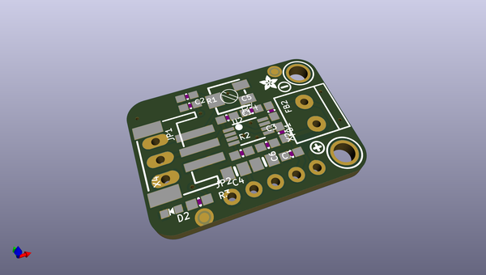
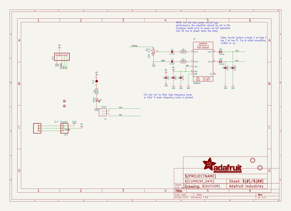
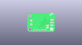
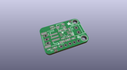
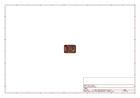
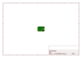
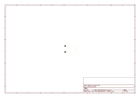
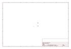
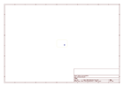
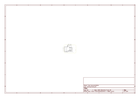

# OOMP Project  
## Adafruit-STEMMA-Audio-Amp-PCB  by adafruit  
  
oomp key: oomp_projects_flat_adafruit_adafruit_stemma_audio_amp_pcb  
(snippet of original readme)  
  
-- Adafruit STEMMA Audio Amp PCB  
  
<a href="http://www.adafruit.com/products/5647">   
Click here to purchase one from the Adafruit shop</a>  
  
PCB files for the Adafruit STEMMA Audio Amp.   
  
Format is EagleCAD schematic and board layout  
* https://www.adafruit.com/product/5647  
  
--- Description  
  
The Adafruit STEMMA Audio Amp is a super small mono amplifier is surprisingly powerful - able to deliver up to 2.5 Watts into 4-8 ohm impedance speakers. Inside the miniature chip is a class D controller, able to run from 2.0V-5.5VDC. Since the amp is a class D, its very efficient (over 90% efficient when driving an 8Ω speaker at over half a Watt) - making it perfect for portable and battery-powered projects. It has built in thermal and over-current protection but we could barely tell it got hot. There's even a volume trim pot so you can adjust the volume on the board down from the default 24dB gain. This board is a welcome upgrade to basic "LM386" amps!  
  
This board is a simplified version of our breadboard-friendly Adafruit Mono 2.5W Class D Audio Amplifier board. This version is designed to be 'plug and play' - with no soldering required. You can input the audio via the JST-PH 3 Pin connector - such as a pin header cable or one with alligator clips. The trade-off is that this board doesn't have differential inputs, instead the audio inputs are referenced to the power/signal ground wire.  
  
The input to the amplifier goes through 1.0uF cap  
  full source readme at [readme_src.md](readme_src.md)  
  
source repo at: [https://github.com/adafruit/Adafruit-STEMMA-Audio-Amp-PCB](https://github.com/adafruit/Adafruit-STEMMA-Audio-Amp-PCB)  
## Board  
  
  
## Schematic  
  
  
  
[schematic pdf](working_schematic.pdf)  
## Images  
  
  
  
  
  
  
  
  
  
  
  
  
  
  
  
  
