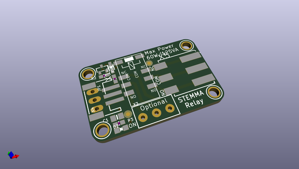
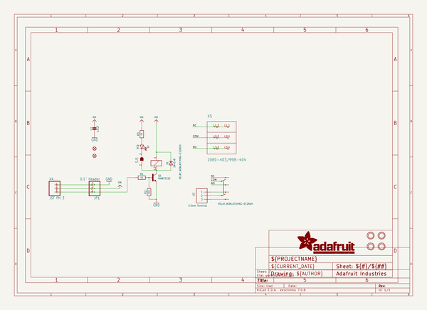
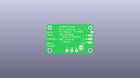
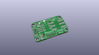
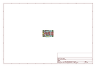
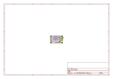
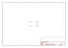
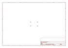
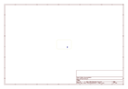
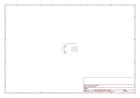

# OOMP Project  
## Adafruit-STEMMA-Non-Latching-Mini-Relay-PCB  by adafruit  
  
oomp key: oomp_projects_flat_adafruit_adafruit_stemma_non_latching_mini_relay_pcb  
(snippet of original readme)  
  
-- Adafruit STEMMA Non-Latching Mini Relay PCB  
  
<a href="http://www.adafruit.com/products/4409">   
Click here to purchase one from the Adafruit shop</a>  
  
PCB files for the Adafruit STEMMA Non-Latching Mini Relay.   
  
Format is EagleCAD schematic and board layout  
* https://www.adafruit.com/product/4409  
  
--- Description  
  
STEMMA plug-and-play parts make your next project soldering-free! This is the STEMMA Non-Latching Mini Relay. It gives you power to control, and control over power. Put simply, you can now turn on and off lamps, fans, solenoids, and other small appliances that run on up to 250VAC or DC power using any microcontroller or microcomputer, with ease.  
  
No worrying about flyback diodes, level shifting, pin protection. The STEMMA board takes care of all that for you. You can use it with any 3V or 5V microcontroller/microcomputer.  To use with a breadboard, Raspberry Pi or Arduino, pair with a JST 3-pin to breadboard cable. If you want to use with a Circuit Playground or micro:bit, we have a cable with alligator clips.  
  
* This  board has a single Signal pin (the white wire). Normally, the relay's COM pin is connected mechanically to the NC pin and the NO pin is disconnected.  
* When the Signal pin is pulled high, the relay switches and the internal switch changes so that the COM pin is mechanically connected to the NO pin and NC is then disconnected  
* When the relay is active, a red LED is lit, and about 50mA of current   
  full source readme at [readme_src.md](readme_src.md)  
  
source repo at: [https://github.com/adafruit/Adafruit-STEMMA-Non-Latching-Mini-Relay-PCB](https://github.com/adafruit/Adafruit-STEMMA-Non-Latching-Mini-Relay-PCB)  
## Board  
  
  
## Schematic  
  
  
  
[schematic pdf](working_schematic.pdf)  
## Images  
  
  
  
  
  
  
  
  
  
  
  
  
  
  
  
  
