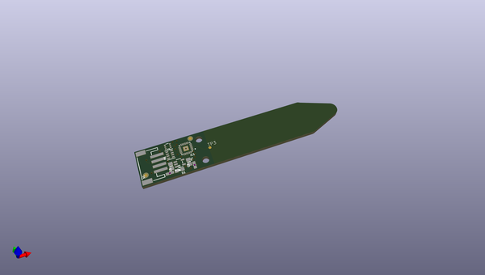
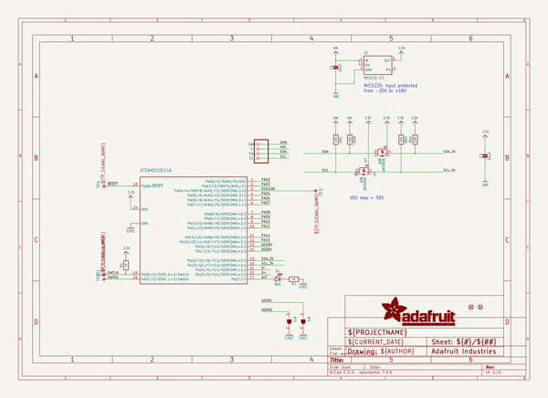
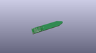
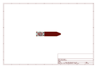
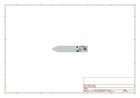
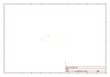
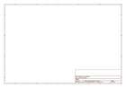
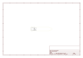

# OOMP Project  
## Adafruit-STEMMA-Soil-Sensor-PCB  by adafruit  
  
oomp key: oomp_projects_flat_adafruit_adafruit_stemma_soil_sensor_pcb  
(snippet of original readme)  
  
-- Adafruit STEMMA Soil Sensor - I2C Capacitive Moisture Sensor PCB  
  
<a href="http://www.adafruit.com/products/4026">   
Click here to purchase one from the Adafruit shop</a>  
  
PCB files for the Adafruit STEMMA Soil Sensor - I2C Capacitive Moisture Sensor. Format is EagleCAD schematic and board layout  
* https://www.adafruit.com/product/4026  
  
--- Description  
  
Most low cost soil sensors are resistive style, where there's two prongs and the sensor measures the conductivity between the two. These work OK at first, but eventually start to oxidize because of the exposed metal. Even if they're gold plated! The resistivity measurement goes up and up, so you constantly have to re-calibrate your code. Also, resistive measurements don't always work in loose soil.  
  
This design is superior with a **capacitive** measurement. Capacitive measurements use only one probe, don't have any exposed metal, and don't introduce any DC currents into your plants. We use the built in capacitive touch measurement system built into the ATSAMD10 chip, which will give you a reading ranging from about 200 (very dry) to 2000 (very wet). As a bonus, we also give you the ambient temperature from the internal temperature sensor on the microcontroller, it's not high precision, maybe good to + or - 2 degrees Celsius.  
  
To make it so you can use the sensor with just about any microcontroller, we have an I2C interface. Connect a 4-pin JST-PH cable (we have a few stoc  
  full source readme at [readme_src.md](readme_src.md)  
  
source repo at: [https://github.com/adafruit/Adafruit-STEMMA-Soil-Sensor-PCB](https://github.com/adafruit/Adafruit-STEMMA-Soil-Sensor-PCB)  
## Board  
  
  
## Schematic  
  
  
  
[schematic pdf](working_schematic.pdf)  
## Images  
  
  
  
  
  
  
  
  
  
  
  
  
  
  
  
  
