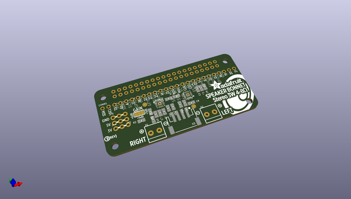
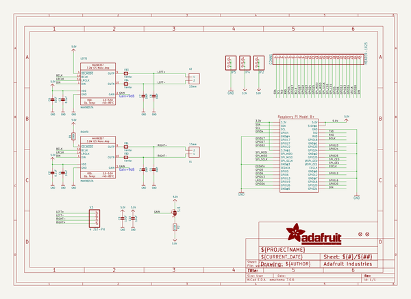

# OOMP Project  
## Adafruit-Stereo-Speaker-Bonnet-PCB  by adafruit  
  
(snippet of original readme)  
  
-- Adafruit Stereo Speaker Bonnet PCB  
  
<a href="http://www.adafruit.com/products/3346">   
Click here to purchase one from the Adafruit shop</a>  
  
PCB files for the Adafruit Stereo Speaker Bonnet for Raspberry Pi. Format is EagleCAD schematic and board layout  
* http://www.adafruit.com/product/3346  
  
--- Description  
  
Hey Mr. DJ! Turn up that Raspberry Pi mix to the max with this cute 3W Stereo Amplifier Bonnet for Raspberry Pi. (It's not big enough to be an official HAT, so we called it a bonnet, you see?) It's the exact same size as a Raspberry Pi Zero but works with any and all Raspberry Pi computers with a 2x20 connector - A+, B+, Zero, Pi 2, Pi 3, etc. We've tested it out with Raspbian (the official operating system) and Retropie.  
  
This Bonnet uses I2S a digital sound standard, so you get really crisp audio. The digital data goes right into the amplifier so there's no static like you hear from the headphone jack. And it's super easy to get started. Just plug in any 4Ω to 8Ω speakers, up to 3 Watts, run our installer script on any Raspberry Pi, reboot and you're ready to jam!  
  
Each order comes as a fully tested and assembled PCB and 2x extra terminal blocks. No soldering required if you're using our 3 Watt speaker set, just plug and play.  
  
--- License  
  
Adafruit invests time and resources providing this open source design, please support Adafruit and open-source hardware by purchasing products from [Adafruit](https://www.ada  
  full source readme at [readme_src.md](readme_src.md)  
  
source repo at: [https://github.com/adafruit/Adafruit-Stereo-Speaker-Bonnet-PCB](https://github.com/adafruit/Adafruit-Stereo-Speaker-Bonnet-PCB)  
## Board  
  
  
## Schematic  
  
  
  
[schematic pdf](working_schematic.pdf)  
## Images  
  
  
  
  
  
  
  
  
  
  
  
  
  
  
  
  
