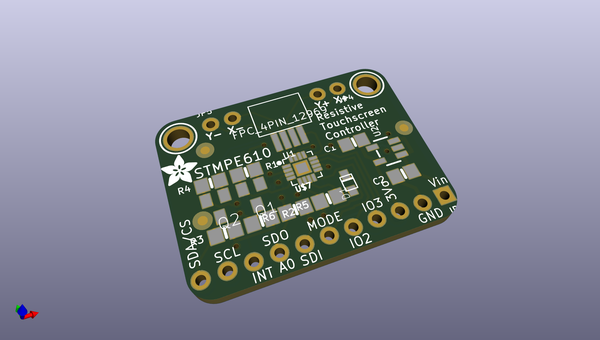
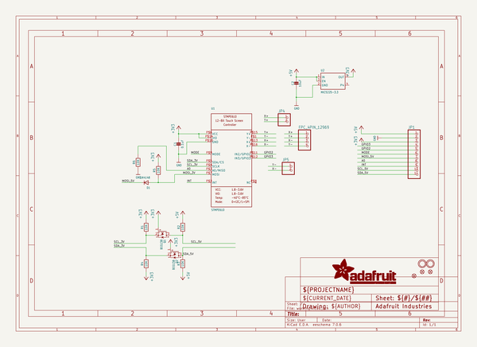
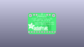
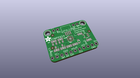
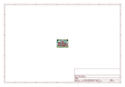
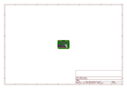
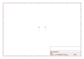
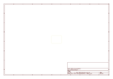
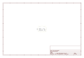

# OOMP Project  
## Adafruit-STMPE610-Breakout-PCB  by adafruit  
  
(snippet of original readme)  
  
- Adafruit Resistive Touch Screen Controller STMPE610 Breakout PCB  
<a href="http://www.adafruit.com/products/1571">   
Click here to purchase one from the Adafruit shop</a>  
  
This breakout board features the STMPE610, which has both I2C and SPI interfaces available. There is also an interrupt pin that you can use to indicate when a touch has been detected to your microcontroller or microcomputer. We wrapped up the chip with a 3V voltage regulator and level shifting so it's safe to use with 3V or 5V logic. Its a nicely designed chip, and has very stable precise readings. We found its also a lot faster than trying to do all the readings on an Arduino.  
  
PCB files for the STMPE610 Breakout, the format is EagleCAD schematic and board layout  
- https://www.adafruit.com/product/1571  
  
--- License  
  
Adafruit invests time and resources providing this open source design, please support Adafruit and open-source hardware by purchasing products from [Adafruit](https://www.adafruit.com)!  
  
All text above must be included in any redistribution  
  
Designed by Limor Fried/Ladyada for Adafruit Industries.  
Creative Commons Attribution/Share-Alike, all text above must be included in any redistribution.   
See license.txt for additional information.  
  
  full source readme at [readme_src.md](readme_src.md)  
  
source repo at: [https://github.com/adafruit/Adafruit-STMPE610-Breakout-PCB](https://github.com/adafruit/Adafruit-STMPE610-Breakout-PCB)  
## Board  
  
  
## Schematic  
  
  
  
[schematic pdf](working_schematic.pdf)  
## Images  
  
  
  
  
  
  
  
  
  
  
  
  
  
  
  
  
