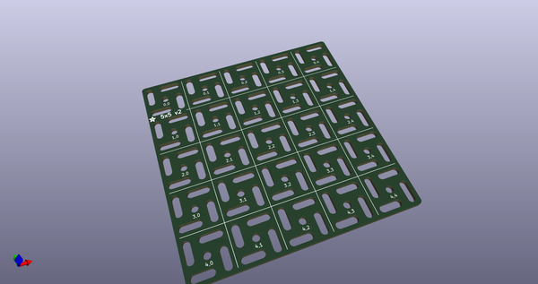
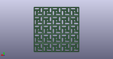
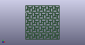

# OOMP Project  
## Adafruit-Swirly-Grid-PCB  by adafruit  
  
(snippet of original readme)  
  
-- Adafruit Swirly Aluminum Mounting Grid for 0.1" Spaced PCBs  
  
<a href="http://www.adafruit.com/products/5774">   
Click here to purchase one from the Adafruit shop</a>  
  
KiCAD PCB files for the Adafruit Swirly Aluminum Mounting Grid for 0.1" Spaced PCBs.   
  
Format is EagleCAD schematic and board layout  
* https://www.adafruit.com/product/5774  
  
--- Description  
  
With most of our dev boards, sensors and feathers now sporting plug-and-play stemma QT ports it can be very fast to put together projects with half a dozen boards snapped together. But that ease of use has one downside: now you don't have a breadboard as a mechanical substrate... which is why we created this nifty swirly grid design to allow for easy mounting of various small microcontroller and sensor boards.  
  
The grid is made out of an 'aluminum PCB' - we have that in quotes because while technically it is made with a PCB process for single-sided aluminum-core PCBs, there's no actual copper on here, its just the aluminum backing, and then black soldermask with silkscreen. The aluminum is conductive both electrically and thermally - so watch out if you are using metal screws to attach stuff. Unless, that is, you want to turn the whole thing into a ground plane in which case: go for it.  
  
Each square is 0.6" x 0.6" and there's holes or slots every 0.2 inches. With the various dots and dashes you can pretty much make anything on a 0.1" grid fit. Each drill hole is 0.1" /   
  full source readme at [readme_src.md](readme_src.md)  
  
source repo at: [https://github.com/adafruit/Adafruit-Swirly-Grid-PCB](https://github.com/adafruit/Adafruit-Swirly-Grid-PCB)  
## Board  
  
  
## Schematic  
  
  
  
[schematic pdf](working_schematic.pdf)  
## Images  
  
  
  
  
  
  
