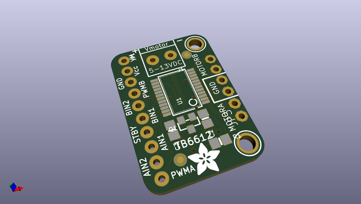
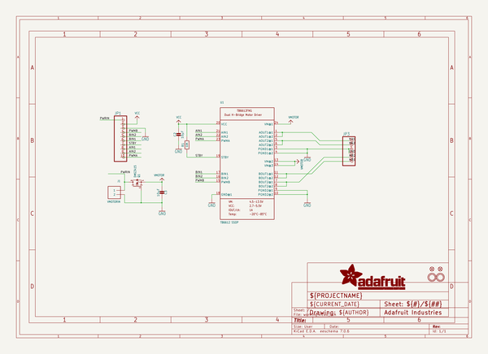
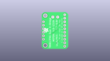
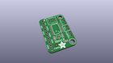
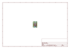
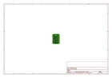
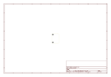
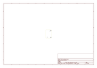
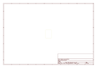
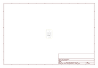

# OOMP Project  
## Adafruit-TB6612-Motor-Driver-Breakout-PCB  by adafruit  
  
(snippet of original readme)  
  
-- Adafruit TB6612 Motor Driver Breakout PCB  
  
<a href="http://www.adafruit.com/products/2448">   
Click here to purchase one from the Adafruit shop</a>  
  
PCB files for the Adafruit TB6612 Motor Driver Breakout. Format is EagleCAD schematic and board layout  
* https://www.adafruit.com/product/2448  
  
--- DESCRIPTION  
Spin two DC motors, step one bi-polar or uni-polar stepper, or fire off two solenoids with 1.2A per channel using the TB6612. These are perhaps better known as "the drivers in our assembled Adafruit Motorshield or Motor HAT." We really like these dual H-bridges, so if you want to control motors without a shield or HAT these are easy to include on any solderless breadboard or perma-proto.  
  
We solder on TB6612 onto a breakout board for you here, with a polarity protection FET on the motor voltage input and a pullup on the "standby" enable pin. Each breakout chip contains two full H-bridges (four half H-bridges). That means you can drive 2-4 solenoids (only two can be active at a time, on opposite bridges), two DC motors bi-directionally, or one stepper motor. Just make sure they're good for 1.2 Amp or less of current, since that's the limit of this chip. They do handle a peak of 3A but that's just for a short amount of time, like 20 milliseconds. What we like most about this particular driver is that it comes with built in kick-back diodes internally so you don't have to worry about the inductive kick damaging your pro  
  full source readme at [readme_src.md](readme_src.md)  
  
source repo at: [https://github.com/adafruit/Adafruit-TB6612-Motor-Driver-Breakout-PCB](https://github.com/adafruit/Adafruit-TB6612-Motor-Driver-Breakout-PCB)  
## Board  
  
  
## Schematic  
  
  
  
[schematic pdf](working_schematic.pdf)  
## Images  
  
  
  
  
  
  
  
  
  
  
  
  
  
  
  
  
