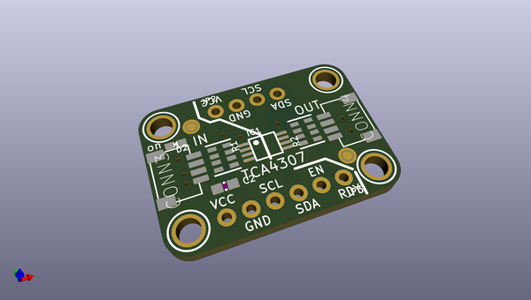
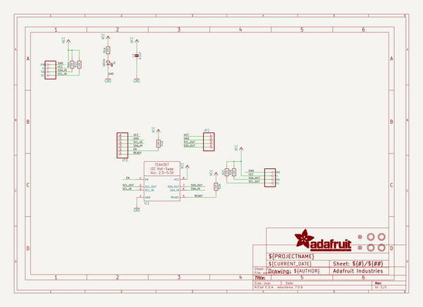
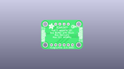
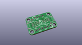
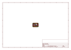
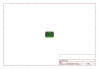
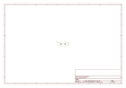

# OOMP Project  
## Adafruit-TCA4307-PCB  by adafruit  
  
oomp key: oomp_projects_flat_adafruit_adafruit_tca4307_pcb  
(snippet of original readme)  
  
-- Adafruit TCA4307 Hot-Swap I2C Buffer with Stuck Bus Recovery PCB  
  
<a href="http://www.adafruit.com/products/5159">   
Click here to purchase one from the Adafruit shop</a>  
  
PCB files for the Adafruit TCA4307 Hot-Swap I2C Buffer with Stuck Bus Recovery.   
  
Format is EagleCAD schematic and board layout  
* https://www.adafruit.com/product/5159  
  
--- Description  
  
As we've been adding  STEMMA QT connectors to our breakouts and dev boards, folks have been really enjoying the simplicity and speed of plugging in I2C sensors and devices for quick iteration and design. That's all good, but I2C wasn't really designed for hot-plugging. You're kinda supposed to have everything connected once on boot and never mess with it - I2C was specified for on-board connections. And, folks who have experimented with hot-plugging I2C devices eventually have discovered that if you plug in or unplug at the wrong moment you can cause the bus to hang due to an extra SCL pulse or an unexpected capacitive load.  
  
The Adafruit TCA4307 Hot-Swap I2C Buffer breakout here solves that problem. It's specifically designed to take a non-hot-swap protocol (I2C) and protect the controller from wayward peripherals messing with the bus during attach/detach.  
  
Usage is super simple. Connect the left side (IN) to your main board controller - Arduino, Raspberry Pi, Feather, etc. Then connect any I2C sensors you like to OUT side. Power is connected through - this isn't a pow  
  full source readme at [readme_src.md](readme_src.md)  
  
source repo at: [https://github.com/adafruit/Adafruit-TCA4307-PCB](https://github.com/adafruit/Adafruit-TCA4307-PCB)  
## Board  
  
  
## Schematic  
  
  
  
[schematic pdf](working_schematic.pdf)  
## Images  
  
  
  
  
  
  
  
  
  
  
  
  
  
  
  
  
