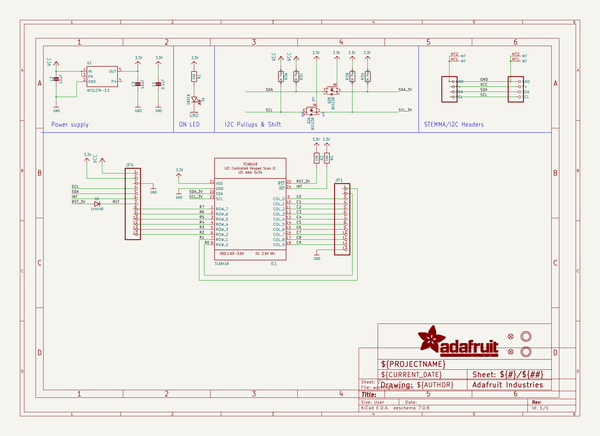

# OOMP Project  
## Adafruit-TCA8418-PCB  by adafruit  
  
(snippet of original readme)  
  
-- Adafruit TCA8418 Keypad Matrix and GPIO Expander Breakout - STEMMA QT / Qwiic PCB  
  
<a href="http://www.adafruit.com/products/4918">   
Click here to purchase one from the Adafruit shop</a>  
  
PCB files for the Adafruit TCA8418 Keypad Matrix and GPIO Expander Breakout - STEMMA QT / Qwiic.   
  
Format is EagleCAD schematic and board layout  
* https://www.adafruit.com/product/4918  
  
--- Description  
  
It's a GPIO expander, it's a keypad matrix driver... its the Adafruit TCA8418 Keypad Matrix and GPIO Expander Breakout - a cute and powerful I2C GPIO expander and keypad matrix driver! This chip is quite fancy, with the ability to act as your I2C multi-tool for handling keypads, buttons or LEDs.  
  
This chip has 18 total 'I/O' pins, 10 columns and 8 rows. You can of course arrange them as a matrix of buttons for a total of 80 switches. Or you can use any subset as individual GPIO input or outputs. The nicest part of the keypad driver is that it has a 10-element event queue, so even if you don't get to the interrupt immediately, keypress and release events will be held for you. Since it's I2C its very easy to use with any microcontroller or computer.  
  
GPIO expanders work like this: you have a board with some number of GPIO but not enough for your project - maybe you need more buttons or LEDs. You could upgrade to a board with massive number of GPIO like the Grand Central, or you could pop on one of these boards. Connect it over I2C and the  
  full source readme at [readme_src.md](readme_src.md)  
  
source repo at: [https://github.com/adafruit/Adafruit-TCA8418-PCB](https://github.com/adafruit/Adafruit-TCA8418-PCB)  
## Board  
  
  
## Schematic  
  
  
  
[schematic pdf](working_schematic.pdf)  
## Images  
  
  
  
  
  
  
  
  
  
  
  
  
  
  
  
  
