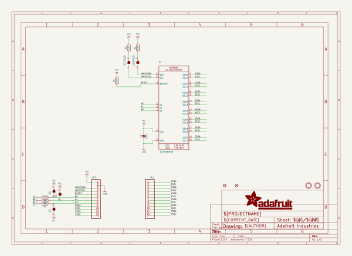

# OOMP Project  
## Adafruit-TCA9548A-I2C-Multiplexer-PCB  by adafruit  
  
oomp key: oomp_projects_flat_adafruit_adafruit_tca9548a_i2c_multiplexer_pcb  
(snippet of original readme)  
  
-- Adafruit TCA9548A I2C Multiplexer PCB  
<a href="http://www.adafruit.com/products/2717">   
Click here to purchase one from the Adafruit shop</a>  
  
You just found the perfect I2C sensor, and you want to wire up two or three or more of them to your Arduino when you realize "Uh oh, this chip has a fixed I2C address, and from what I know about I2C, you cannot have two devices with the same address on the same SDA/SCL pins!" Are you out of luck? You would be, if you didn't have this ultra-cool TCA9548A 1-to-8 I2C multiplexer!  
  
Finally, a way to get up to 8 same-address I2C devices hooked up to one microcontroller - this multiplexer acts as a gatekeeper, shuttling the commands to the selected set of I2C pins with your command.  
  
Using it is fairly straight-forward: the multiplexer itself is on I2C address 0x70 (but can be adjusted from 0x70 to 0x77) and you simply write a single byte with the desired multiplexed output number to that port, and bam - any future I2C packets will get sent to that port. In theory, you could have 8 of these multiplexers on each of 0x70-0x77 addresses in order to control 64 of the same-I2C-addressed-part.  
  
PCB files for the Adafruit TCA9548A I2C Multiplexer. The format is EagleCAD schematic and board layout  
- https://www.adafruit.com/products/2717  
  
--- License  
  
Adafruit invests time and resources providing this open source design, please support Adafruit and open-source hardware by purchasing products   
  full source readme at [readme_src.md](readme_src.md)  
  
source repo at: [https://github.com/adafruit/Adafruit-TCA9548A-I2C-Multiplexer-PCB](https://github.com/adafruit/Adafruit-TCA9548A-I2C-Multiplexer-PCB)  
## Board  
  
  
## Schematic  
  
  
  
[schematic pdf](working_schematic.pdf)  
## Images  
  
  
  
  
  
  
  
  
  
  
  
  
  
  
  
  
