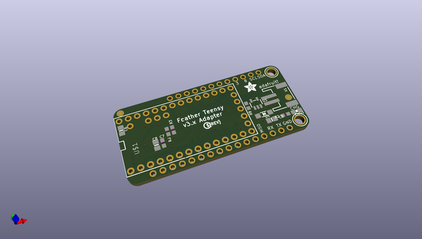
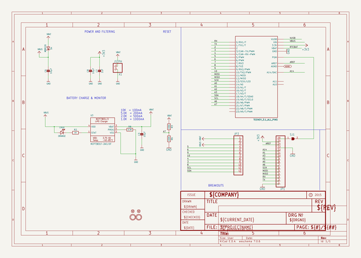
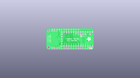
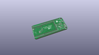
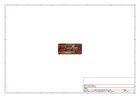
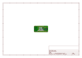
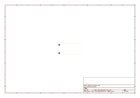
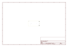
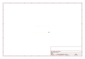
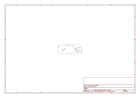

# OOMP Project  
## Adafruit-Teensy-3.x-Feather-Adapter-PCB  by adafruit  
  
(snippet of original readme)  
  
-- Adafruit Teensy 3.x Feather Adapter PCB  
<a href="http://www.adafruit.com/products/3200">   
Click here to purchase one from the Adafruit shop</a>  
  
This Feather adapter rearranges the pins of a Teensy 3.x to give you the same shape and pinout for our Feathers. We've tested our FeatherWings so far and all are drop-in compatible. It's a great way to take advantage of the Feather ecosystem. Give your Teensy a stepper/DC motor driver, GPS, LED matrix or OLED add-on with ease. With the space left over, we even added in a 500mA LiPoly charger that automatically charges over USB and will switch over to the LiPo when USB is unplugged. There's also a 100K resistor divider for monitoring the battery voltage connected to A7  
  
PCB files for the Adafruit Teensy 3.x Feather Adapter. The format is EagleCAD schematic and board layout  
- https://www.adafruit.com/product/3200  
  
--- License  
  
Adafruit invests time and resources providing this open source design, please support Adafruit and open-source hardware by purchasing products from [Adafruit](https://www.adafruit.com)!  
  
All text above must be included in any redistribution  
  
Designed by Limor Fried/Ladyada for Adafruit Industries.  
Creative Commons Attribution/Share-Alike, all text above must be included in any redistribution.   
See license.txt for additional information.  
  
  full source readme at [readme_src.md](readme_src.md)  
  
source repo at: [https://github.com/adafruit/Adafruit-Teensy-3.x-Feather-Adapter-PCB](https://github.com/adafruit/Adafruit-Teensy-3.x-Feather-Adapter-PCB)  
## Board  
  
  
## Schematic  
  
  
  
[schematic pdf](working_schematic.pdf)  
## Images  
  
  
  
  
  
  
  
  
  
  
  
  
  
  
  
  
