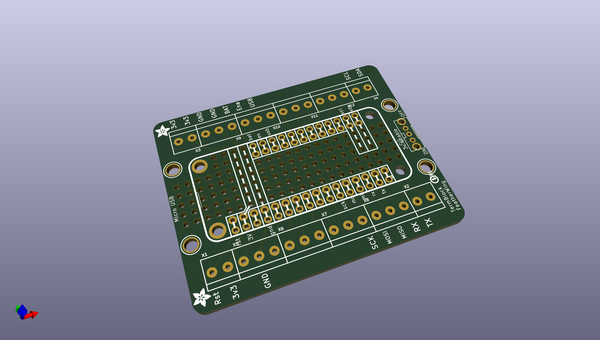
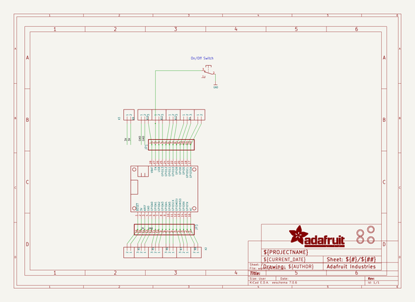
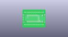
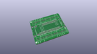
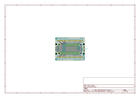
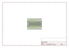
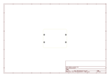
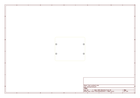
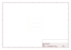

# OOMP Project  
## Adafruit-Terminal-Block-FeatherWing-PCB  by adafruit  
  
(snippet of original readme)  
  
-- Adafruit Terminal Block FeatherWing PCB  
<a href="http://www.adafruit.com/products/2926">   
Click here to purchase one from the Adafruit shop</a>  
  
The Terminal Block Breakout FeatherWing kit is like the Golden Eagle of prototyping FeatherWings (eg. majestic, powerful, good-looking). To start, you get a nice prototyping area underneath your Feather, with extra pads for ground, 3.3V and SDA/SCL. Not one to stop there, we expanded the PCB out to 2" x 2.5" with 3.5mm pitch terminal blocks down each side. There's also four mounting holes so you can attach the breakout to your enclosure or project.  
  
This product works with all our Feathers! The terminal blocks allow you to connect to any of the external Feather pins, great for wiring temporary or permanent installations. We also give you a few extra terminal block pins for ground and 3.3V connections since those are so useful.  
  
Finally, there's a slide switch, which connects the EN pin to ground when in the 'off' position, cutting off the 3.3V regulator. Note that the FONA Feather uses both VBat and 3.3V as power supplies so you wont be able to fully turn off the FONA Feather with this switch.  
  
PCB files for Adafruit Terminal Block FeatherWing. The format is EagleCAD schematic and board layout  
- http://www.adafruit.com/products/2926  
  
--- License  
  
Adafruit invests time and resources providing this open source design, please support Adafruit and open-source hardware by purchasin  
  full source readme at [readme_src.md](readme_src.md)  
  
source repo at: [https://github.com/adafruit/Adafruit-Terminal-Block-FeatherWing-PCB](https://github.com/adafruit/Adafruit-Terminal-Block-FeatherWing-PCB)  
## Board  
  
  
## Schematic  
  
  
  
[schematic pdf](working_schematic.pdf)  
## Images  
  
  
  
  
  
  
  
  
  
  
  
  
  
  
  
  
