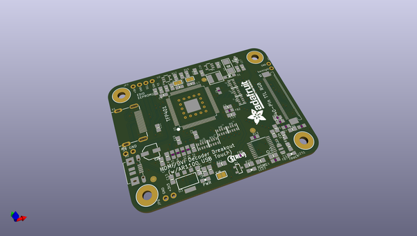
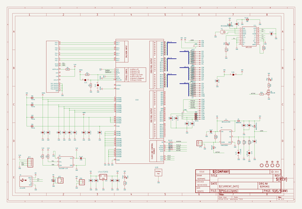
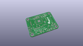
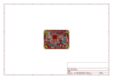
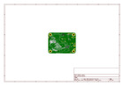
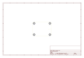
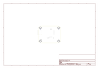
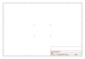
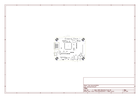
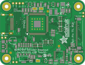

# OOMP Project  
## Adafruit-TFP401-HDMI-To-40Pin-TFT-PCB  by adafruit  
  
oomp key: oomp_projects_flat_adafruit_adafruit_tfp401_hdmi_to_40pin_tft_pcb  
(snippet of original readme)  
  
-- Adafruit TFP401 HDMI Decoder Breakout PCB  
&nbsp;    
Click to purchase from the Adafruit Shop:  
- [TFP401 HDMI/DVI Decoder to 40-Pin TTL Breakout - Without Touch](https://www.adafruit.com/product/2218)  
- [TFP401 HDMI/DVI Decoder to 40-Pin TTL Breakout - With Touch](https://www.adafruit.com/product/2219)  
  
It's a mini HDMI decoder board! So small and simple, you can use this board as an all-in-one display driver for TTL displays, or perhaps decoding HDMI/DVI video for some other project. This breakout features the TFP401 for decoding video, and for the touch version, an AR1100 USB resistive touch screen driver.  
  
The TFP401 is a beefy DVI/HDMI decoder from TI. It can take unencrypted video and pipe out the raw 24-bit color pixel data - HDCP not supported! It will decode any resolution from 25-165MHz pixel clock, basically up to 1080p. We've used this breakout with 800x480 displays, so we have not specifically tested it with higher resolutions. We added a bunch of supporting circuitry like a backlight driver and configured it for running basic TTL display panels such as the ones we have in the shop  
  
There are two versions, one is video only and one is video+touch.   
  
PCB Files for the Adafruit TFP401 HDMI Decoder Breakout. The format is EagleCAD schematic and board layout  
  
Fo  
  full source readme at [readme_src.md](readme_src.md)  
  
source repo at: [https://github.com/adafruit/Adafruit-TFP401-HDMI-To-40Pin-TFT-PCB](https://github.com/adafruit/Adafruit-TFP401-HDMI-To-40Pin-TFT-PCB)  
## Board  
  
  
## Schematic  
  
  
  
[schematic pdf](working_schematic.pdf)  
## Images  
  
  
  
  
  
  
  
  
  
  
  
  
  
  
  
  
  
  
