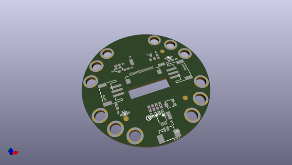
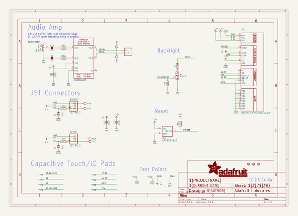
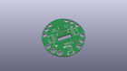
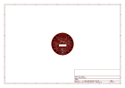
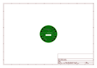
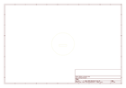
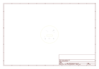
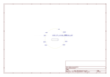
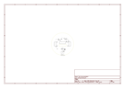

# OOMP Project  
## Adafruit-TFT-Gizmo-PCB  by adafruit  
  
oomp key: oomp_projects_flat_adafruit_adafruit_tft_gizmo_pcb  
(snippet of original readme)  
  
-- Adafruit Circuit Playground TFT Gizmo - Bolt-on Display + Audio Amplifier PCB  
  
<a href="http://www.adafruit.com/products/4367">   
Click here to purchase one from the Adafruit shop</a>  
  
PCB files for the Adafruit Circuit Playground TFT Gizmo - Bolt-on Display + Audio Amplifier.   
  
Format is EagleCAD schematic and board layout  
* https://www.adafruit.com/product/4367  
  
--- Description  
  
Extend and expand your Circuit Playground projects with a bolt on TFT Gizmo that lets you add a lovely color display in a sturdy and reliable fashion. This PCB looks just like a round TFT breakout but has permanently affixed M3 standoffs that act as mechanical and electrical connections.  
  
Once attached you'll get a 1.54" 240x240 IPS display with backlight control, two 3-pin STEMMA connectors for attaching NeoPixel strips or servos, and a Class D audio amplifier with a Molex PicoBlade connector that can plug one of our lil speakers.  
  
This is a great companion for our Circuit Playground Express or Bluefruit boards thanks to their fast SPI hardware speeds, and works in Arduino and CircuitPython. You can use it with the Circuit Playground Classic but it won't be very fast, as you have to bitbang the SPI - and the display has a lot of pixels - so it's not recommended.  
  
Comes with a PCB that has pre-soldered standoffs attached, and 12x M3 screws for attachment. Fits all Circuit Playgrounds but like we mentioned earlier, the Express and Bluefruit are   
  full source readme at [readme_src.md](readme_src.md)  
  
source repo at: [https://github.com/adafruit/Adafruit-TFT-Gizmo-PCB](https://github.com/adafruit/Adafruit-TFT-Gizmo-PCB)  
## Board  
  
  
## Schematic  
  
  
  
[schematic pdf](working_schematic.pdf)  
## Images  
  
  
  
  
  
  
  
  
  
  
  
  
  
  
  
  
