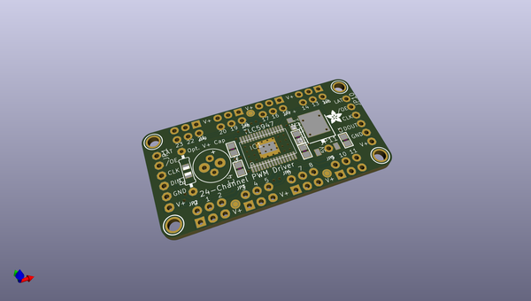
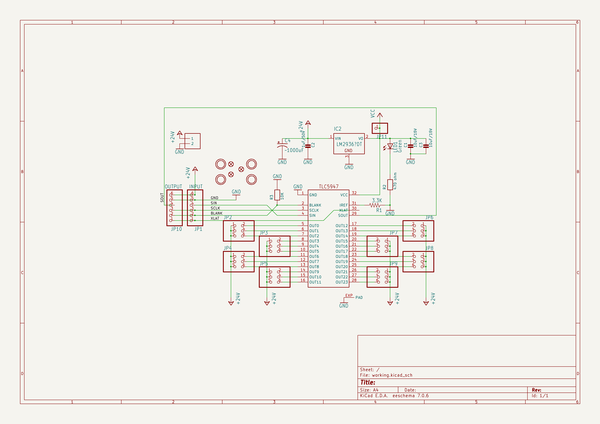
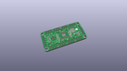
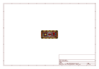
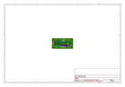
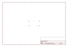
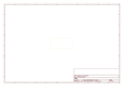
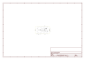

# OOMP Project  
## Adafruit-TLC5947-PCB  by adafruit  
  
oomp key: oomp_projects_flat_adafruit_adafruit_tlc5947_pcb  
(snippet of original readme)  
  
-- Adafruit 24-Channel 12-bit PWM LED Driver - SPI Interface TLC5947 PCB  
<a href="http://www.adafruit.com/products/1429">   
Click here to purchase one from the Adafruit shop</a>  
  
For all of you out there who want to control 24 channels of PWM, we salute you! We also would like you to check out this breakout board for the TLC5947 PWM driver chip. This chip can control 24 separate channels of 12-bit PWM output. Designed (and ideal) for LED control, this board is not good for driving servos. If you need to drive servos, we have a controller for that over here.  
  
Only three "SPI" pins are required to send data (our Arduino library shows how to to use any digital microcontroller pins). Best of all, the design is completely chainable. As long as there's enough power for all the boards you can chain as many as you'd like, like a little trail of blue PCBs stretching out into the sunset. Each of the 24 output's is constant-current and open drain. You can drive multiple LEDs in series, with a V+ anode supply of up to 30V. If you want to drive something that requires a digital input, you must use a pullup resistor from the drive pin to your logic level to create the full waveform.  
  
PCB files for Adafruit TLC5947 24-channel PWM Driver PCB. The format is EagleCAD schematic and board layout  
- http://www.adafruit.com/products/1429  
  
--- License  
  
Adafruit invests time and resources providing this open source design, please support Adafruit   
  full source readme at [readme_src.md](readme_src.md)  
  
source repo at: [https://github.com/adafruit/Adafruit-TLC5947-PCB](https://github.com/adafruit/Adafruit-TLC5947-PCB)  
## Board  
  
  
## Schematic  
  
  
  
[schematic pdf](working_schematic.pdf)  
## Images  
  
  
  
  
  
  
  
  
  
  
  
  
  
  
  
  
