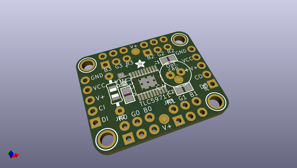
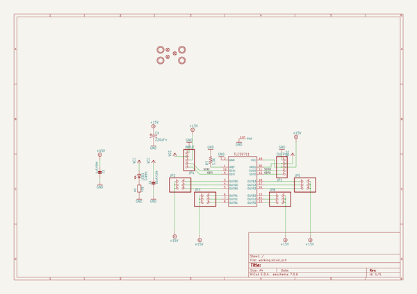
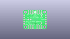
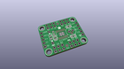
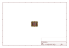
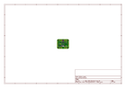
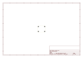
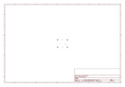
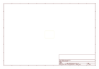

# OOMP Project  
## Adafruit-TLC59711-Breakout-PCB  by adafruit  
  
oomp key: oomp_projects_flat_adafruit_adafruit_tlc59711_breakout_pcb  
(snippet of original readme)  
  
- PCB for the Adafruit TLC59711 12-LED PWM breakout board  
  
<a href="http://www.adafruit.com/products/1455"> Click here to purchase one from the Adafruit shop</a>  
  
For all of you out there who want to control 12 channels of PWM, we salute you! We also would like you to check out this breakout board for the TLC59711 PWM driver chip. This chip can control 12 separate channels of 16-bit PWM output. This is the highest-resolution PWM board we've seen! Designed (and ideal) for precision LED control, this board is not good for driving servos. If you need to drive servos, [we have a controller for that over here](http://www.adafruit.com/products/815).  
  
Only two "SPI" pins are required to send data (our Arduino library shows how to to use any digital microcontroller pins). Best of all, the design is completely chainable. As long as there's enough power for all the boards you can chain as many as you'd like, like a little trail of blue PCBs stretching out into the sunset. Each of the 12 outputs are constant-current and open drain. You can drive multiple LEDs in series, with a V+ anode supply of up to 17V. If you want to drive something that requires a digital input, you must use a pullup resistor from the drive pin to your logic level to create the full waveform.  
  
One resistor is used to set the current for each of the outputs, the constant current means that the LED brightness doesn't vary if the power supply dips. We use a 3.3K r  
  full source readme at [readme_src.md](readme_src.md)  
  
source repo at: [https://github.com/adafruit/Adafruit-TLC59711-Breakout-PCB](https://github.com/adafruit/Adafruit-TLC59711-Breakout-PCB)  
## Board  
  
  
## Schematic  
  
  
  
[schematic pdf](working_schematic.pdf)  
## Images  
  
  
  
  
  
  
  
  
  
  
  
  
  
  
  
  
