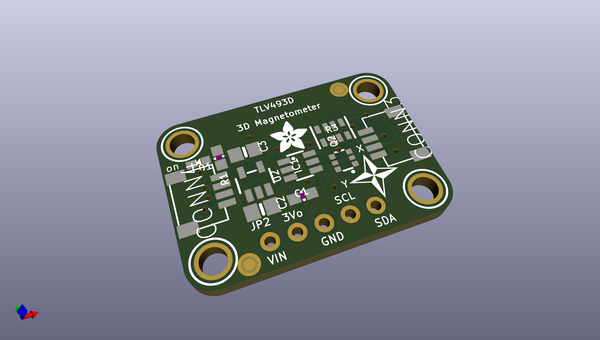
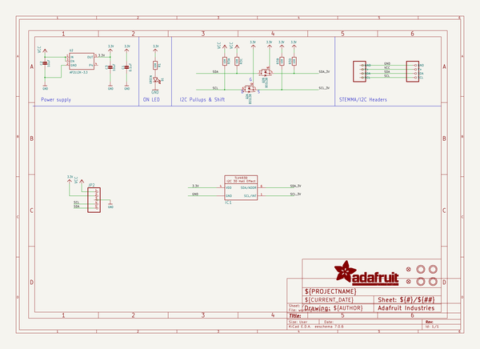
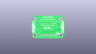
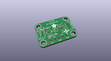
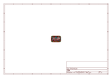
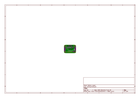
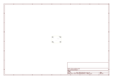
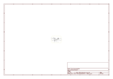
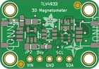

# OOMP Project  
## Adafruit-TLV493D-PCB  by adafruit  
  
(snippet of original readme)  
  
-- Adafruit TLV493D Triple-Axis Magnetometer PCB  
  
<a href="http://www.adafruit.com/products/4366">   
Click here to purchase one from the Adafruit shop</a>  
  
PCB files for the Adafruit TLV493D Triple-Axis Magnetometer.   
  
Format is EagleCAD schematic and board layout  
* https://www.adafruit.com/product/4366  
  
--- Description  
The TLV493D 3-axis magnetometer is a great little sensor for detecting magnets [_in 3D_](https://www.youtube.com/watch?v=3FQDUX6X6-w). In fact, the manufacturer Infineon suggests it could be used to make a joystick! You could also use it for other cool things like detecting objects with magnets attached, like the lid of a box, or maybe a statue that unlocks your secret lair when placed on your mantle?  
  
The TLD493D excels at measuring nearby magnetic fields in three dimensions. It's not going to make a good compass, it's not sensitive enough to pick up the Earth's magnetic field, but you can use it to track the movement of nearby magnets in three dimensions.   
  
Here are a few specs:  
  
 * Digital output via 2-wire based standard I2C interface up to 1 MBit/sec  
 * 12-bit data resolution for each measurement direction  
 * Bx, By and Bz linear field measurement up to +130 [mT](https://en.wikipedia.org/wiki/Tesla_\(unit\))  
 * Excellent matching of X/Y measurement for accurate angle sensing  
  
As we are wont to do, we've made the TLV easy to use by putting it on a breakout PCB along with the circuitry to support it. A vo  
  full source readme at [readme_src.md](readme_src.md)  
  
source repo at: [https://github.com/adafruit/Adafruit-TLV493D-PCB](https://github.com/adafruit/Adafruit-TLV493D-PCB)  
## Board  
  
  
## Schematic  
  
  
  
[schematic pdf](working_schematic.pdf)  
## Images  
  
  
  
  
  
  
  
  
  
  
  
  
  
  
  
  
  
  
