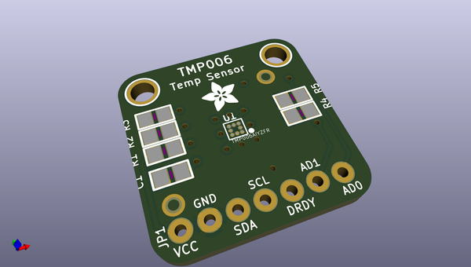
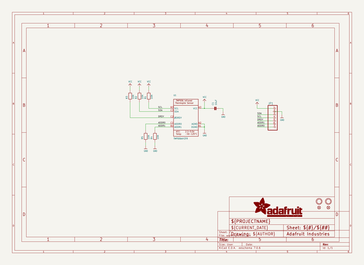
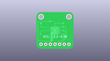
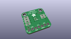
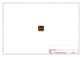
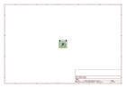
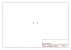
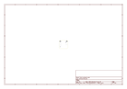
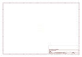
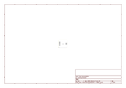

# OOMP Project  
## Adafruit-TMP006-and-TMP007-PCB  by adafruit  
  
oomp key: oomp_projects_flat_adafruit_adafruit_tmp006_and_tmp007_pcb  
(snippet of original readme)  
  
- Adafruit TMP006 and TMP007 PCBs  
&nbsp;    
Click to purchase from the Adafruit Shop:  
- [Contact-less Infrared Thermopile Sensor Breakout - TMP006](https://www.adafruit.com/product/1296)  
- [Contact-less Infrared Thermopile Sensor Breakout - TMP007 (DISCONTINUED)](https://www.adafruit.com/product/2023)  
  
Unlike all the other temperature sensors we have, this breakout has a really cool IR sensor from TI that can measure the temperature of an object without touching it! Simply point the sensor towards what you want to measure and it will detect the temperature by absorbing IR waves emitted. The embedded thermopile sensor generates a very very small voltage depending on how much IR there is, and using some math, that micro voltage can be used to calculate the temperature. It also takes the measurement over an area so it can be handy for determining the average temperature of something.  
  
These are the Eagle CAD files for the Adafruit TMP006/TMP007 sensor breakout (same layout, different silkscreen):  
  
  ----> https://www.adafruit.com/products/1296  
  
  ----> https://www.adafruit.com/products/2023 (DISCONTINUED)  
  
--- License  
  
Adafruit invests time and resources providing this open source design, please support Adafruit and open-source hardware by [purchasing products from Adafruit]  
  full source readme at [readme_src.md](readme_src.md)  
  
source repo at: [https://github.com/adafruit/Adafruit-TMP006-and-TMP007-PCB](https://github.com/adafruit/Adafruit-TMP006-and-TMP007-PCB)  
## Board  
  
  
## Schematic  
  
  
  
[schematic pdf](working_schematic.pdf)  
## Images  
  
  
  
  
  
  
  
  
  
  
  
  
  
  
  
  
