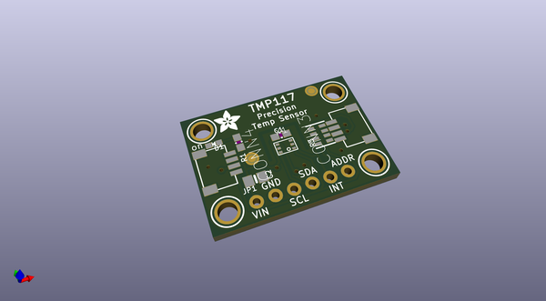
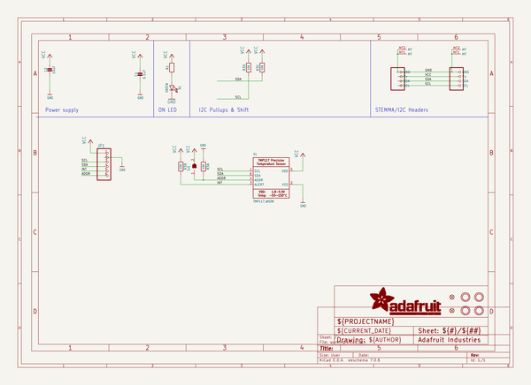

# OOMP Project  
## Adafruit-TMP117-PCB  by adafruit  
  
(snippet of original readme)  
  
-- Adafruit TMP117 High-accuracy Temperature Sensor PCB  
  
<a href="http://www.adafruit.com/products/4821">   
Click here to purchase one from the Adafruit shop</a>  
  
PCB files for the Adafruit TMP117 High-accuracy Temperature Sensor.   
  
Format is EagleCAD schematic and board layout  
* https://www.adafruit.com/product/4821  
  
--- Description  
  
The TMP117 Precision Temperature Sensor is an I2C temperature sensor that will help you easily add temperature measurement and adjustment to your project. In addition to the obvious support for reading the temperature, the TMP117 can also monitor the temperature and alert you when corrective action needs to be taken.   
  
With 16-bit measurement resolution and ±0.1°C accuracy, as well as high and low temperature alerts and interrupt support, and hardware support required for NIST traceability, this temperature sensor is perfect for applications where you need to keep a close eye on temperature. The manufacturer, Texas Instruments even suggest it for use in sensitive applications like thermostats and cold chain asset tracking or even gas and heat meters!  
  
To make using it as easy as possible, we’ve put the TMP117 on a breakout PCB  in our Stemma QT form factor with a sprinkle of support circuitry to give you options when testing. You can either use a bread board or the Stemma QT connectors, and it is compatible with 5V voltage levels as commonly found on Arduinos as well as 3.3V logic used by many  
  full source readme at [readme_src.md](readme_src.md)  
  
source repo at: [https://github.com/adafruit/Adafruit-TMP117-PCB](https://github.com/adafruit/Adafruit-TMP117-PCB)  
## Board  
  
  
## Schematic  
  
  
  
[schematic pdf](working_schematic.pdf)  
## Images  
  
  
  
  
  
  
  
  
  
  
  
  
  
  
  
  
