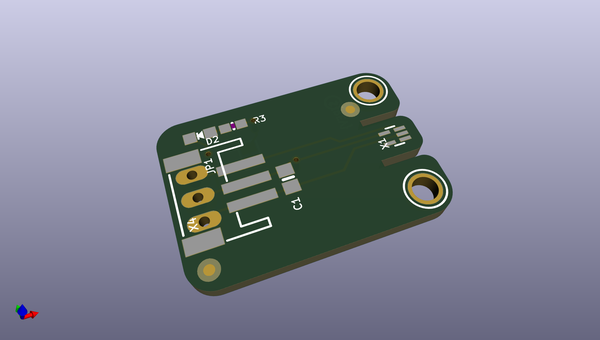
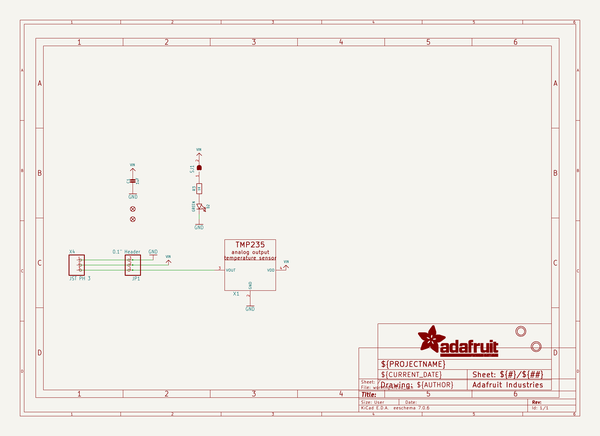
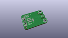
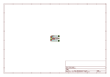
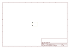
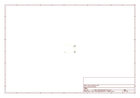
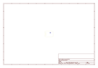
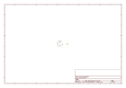

# OOMP Project  
## Adafruit-TMP235-PCB  by adafruit  
  
oomp key: oomp_projects_flat_adafruit_adafruit_tmp235_pcb  
(snippet of original readme)  
  
-- Adafruit TMP235 Plug-and-Play STEMMA Analog Temperature Sensor PCB  
  
<a href="http://www.adafruit.com/products/4686">   
Click here to purchase one from the Adafruit shop</a>  
  
PCB files for the Adafruit TMP235 Plug-and-Play STEMMA Analog Temperature Sensor.   
  
Format is EagleCAD schematic and board layout  
* https://www.adafruit.com/product/4686  
  
--- Description  
  
For fans of the TMP36, we now have a very similar analog temperature sensor with a 3-pin JST connector (we call these STEMMA connectors). Unlike many of our temperature sensors, this one is analog output, not I2C, so its best used by a microcontroller with an analog input, as most microcontrollers do.  
  
These sensors are very simple to use, no libraries or complex configurations required. Plug this board into any of our 3-pin JST PH cables (we have ones with header ends, alligator clips, etc) Red goes to 3V to 5V DC power, black wire connects to ground, and white wire connects to an analog input. The voltage out is 0V at -50°C and 1.75V at 125°C. You can easily calculate the temperature from the voltage in millivolts: Temp °C = 100*(reading in V) - 50  
  
--- License  
  
Adafruit invests time and resources providing this open source design, please support Adafruit and open-source hardware by purchasing products from [Adafruit](https://www.adafruit.com)!  
  
Designed by Limor Fried/Ladyada for Adafruit Industries.  
  
Creative Commons Attribution/Share-Alike, all text above must   
  full source readme at [readme_src.md](readme_src.md)  
  
source repo at: [https://github.com/adafruit/Adafruit-TMP235-PCB](https://github.com/adafruit/Adafruit-TMP235-PCB)  
## Board  
  
  
## Schematic  
  
  
  
[schematic pdf](working_schematic.pdf)  
## Images  
  
  
  
  
  
  
  
  
  
  
  
  
  
  
  
  
