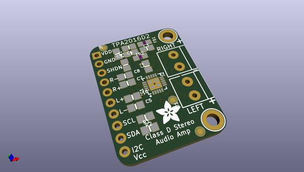
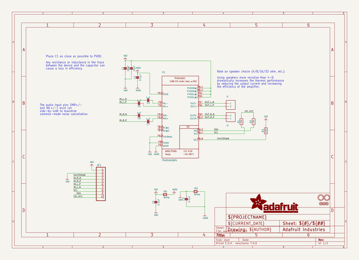
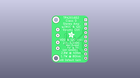
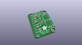
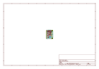
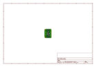
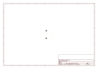
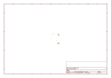
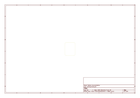
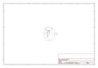

# OOMP Project  
## Adafruit-TPA2016-PCB  by adafruit  
  
oomp key: oomp_projects_flat_adafruit_adafruit_tpa2016_pcb  
(snippet of original readme)  
  
- Adafruit Stereo 2.8W Class D Audio Amplifier TPA2016 PCB  
<a href="http://www.adafruit.com/products/1712">   
Click here to purchase one from the Adafruit shop</a>  
  
A mini class D with AGC and I2C control? Yes please! This incredibly small stereo amplifier is surprisingly powerful. It is able to deliver 2 x 2.8W channels into 4 ohm impedance speakers (@ 10% THD) and it has a i2c control interface as well as an AGC (automatic gain control) system to keep your audio from clipping or distorting.  
  
If you don't want to use I2C to control it, it does start up on with 6dB gain by default and the AGC set up for most music playing. We do suggest using it with a microcontroller to configure it, however, since its quite powerful. Settings are not stored in the chip, so you'll need to adjust any gain & AGC amplification settings every time the amp is powered up.  
  
Inside the miniature chip is a class D controller, able to run from 2.7V-5.5VDC. Since the amp is a class D, it's incredibly efficient (89% efficient when driving an 8Ω speaker at 1.5 Watt) - making it perfect for portable and battery-powered projects. It has built in thermal and over-current protection but we could barely tell if it got hot. This board is a welcome upgrade to basic "LM386" amps!  
  
PCB files for Adafruit TPA2016 I2C Audio Amplifier PCB. The format is EagleCAD schematic and board layout: https://www.adafruit.com/products/1712  
  
--- License  
  
Adafruit invests time  
  full source readme at [readme_src.md](readme_src.md)  
  
source repo at: [https://github.com/adafruit/Adafruit-TPA2016-PCB](https://github.com/adafruit/Adafruit-TPA2016-PCB)  
## Board  
  
  
## Schematic  
  
  
  
[schematic pdf](working_schematic.pdf)  
## Images  
  
  
  
  
  
  
  
  
  
  
  
  
  
  
  
  
