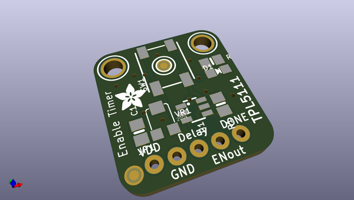
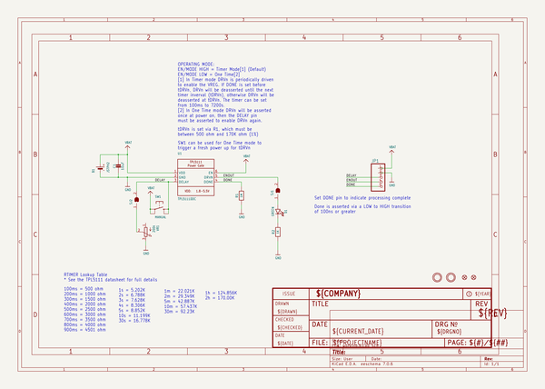
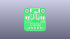
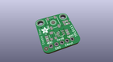
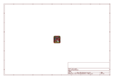
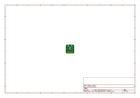
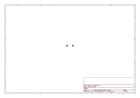
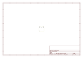
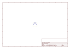
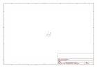

# OOMP Project  
## Adafruit-TPL5111-Reset-Enable-Timer-PCB  by adafruit  
  
(snippet of original readme)  
  
-- Adafruit TPL5111 Reset Enable Timer PCB  
  
<a href="http://www.adafruit.com/products/3573">   
Click here to purchase one from the Adafruit shop</a>  
  
PCB files for the Adafruit TPL111 Reset Enable Timer. For more details, Pick up one today & check out the product page at  
* https://www.adafruit.com/products/3573  
  
--- Description  
  
With some development boards, low power usage is an afterthought. Especially when price and usability are the main selling points. So what should you do when it's time to turn around and make that project of yours run on a battery or solar? Sure you could try to hot-air that regulator off, or you could jerry-rig a relay. Or, use a 555? Ugh, the options aren't that great.  
  
The Adafruit TPL5111 Low Power Reset Timer is a stand-alone breakout that will turn any electronics into low-power electronics! It will take care of enabling & disabling your electronics using a built in timer that can vary from once-every 100ms up to once every two hours. Basically, the TPL will set an enable pin high periodically, adjustable by potentiometer or resistor, and turn on your project's power. It will then wait until a signal is received from the project to tell the TPL that it can safely disable the project by setting the enable pin low. If the TPL does not receive a signal by the set time-out, it will reset the device like a watchdog timer.  
  
We also have a TPL5110 breakout, which rather than setting an enable pin hi  
  full source readme at [readme_src.md](readme_src.md)  
  
source repo at: [https://github.com/adafruit/Adafruit-TPL5111-Reset-Enable-Timer-PCB](https://github.com/adafruit/Adafruit-TPL5111-Reset-Enable-Timer-PCB)  
## Board  
  
  
## Schematic  
  
  
  
[schematic pdf](working_schematic.pdf)  
## Images  
  
  
  
  
  
  
  
  
  
  
  
  
  
  
  
  
