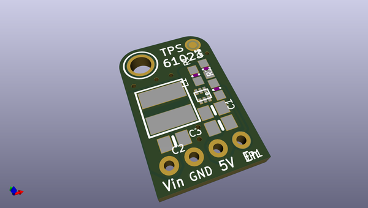
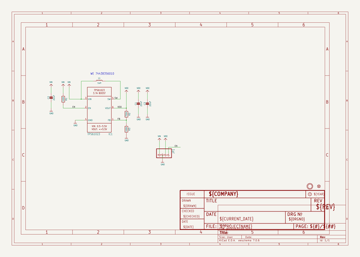
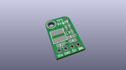
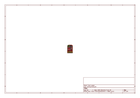
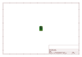
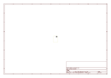
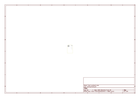
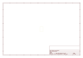
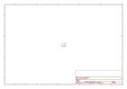

# OOMP Project  
## Adafruit-TPS61023-PCB  by adafruit  
  
(snippet of original readme)  
  
-- Adafruit Adafruit MiniBoost 5V at 1A - TPS61023 PCB  
  
<a href="http://www.adafruit.com/products/4654">   
Click here to purchase one from the Adafruit shop</a>  
  
PCB files for the Adafruit Adafruit MiniBoost 5V at 1A - TPS61023.  
  
Format is EagleCAD schematic and board layout  
* https://www.adafruit.com/product/4654  
  
--- Description  
  
This adorable little board will come in very handy whenever you need a good amount of 5V power. It's the size of a linear regulator, but it's actually a mini-booster! Input 2-5VDC on one side, and get 5V at up to 1A supply on the other. Perfect for use with battery-powered projects with 2 or 3 Alkaline, or a single Lithium battery.  
  
This booster uses a very small but thermally efficient chip from TI, the TPS61023. This chip has nearly everything integrated, including dual 3A MOSFET switches. Note that the switch doesn't tell you the max output, see the tables below for that!  
  
We set the feedback resistors to give a 5.2V output, this is a little higher than 5V which helps account for voltage drop over cables. We took some measurements of the input/output current and max draw using a bench-top power supply and electronic load:  
  
    At 2V DC in, max current out at 5V is 300mA (the minimum input voltage that will 'boot' the booster)  
    At 2.5V DC in, max current out at 5V is 500mA (two NiMH rechargables)  
    At 3V DC in, max current out at 5V is 800mA (two alkalines or a near-dead LiPo)  
    At 3.5V   
  full source readme at [readme_src.md](readme_src.md)  
  
source repo at: [https://github.com/adafruit/Adafruit-TPS61023-PCB](https://github.com/adafruit/Adafruit-TPS61023-PCB)  
## Board  
  
  
## Schematic  
  
  
  
[schematic pdf](working_schematic.pdf)  
## Images  
  
  
  
  
  
  
  
  
  
  
  
  
  
  
  
  
