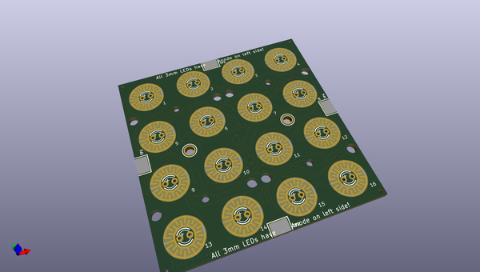
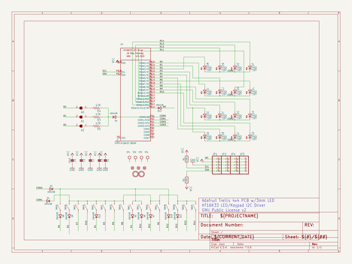
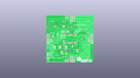
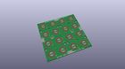
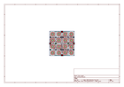
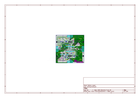
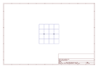
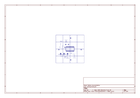
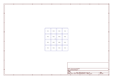

# OOMP Project  
## Adafruit_Trellis  by adafruit  
  
oomp key: oomp_projects_flat_adafruit_adafruit_trellis  
(snippet of original readme)  
  
- CAD & PCB data for the Adafruit Trellis keypad & control PCB  
  
<a href="http://www.adafruit.com/products/1611"> Click here to purchase one from the Adafruit shop</a>  
  
* [Silicone Elastomer 4x4 Button Keypad - for 3mm LEDs](https://www.adafruit.com/product/1611)  
* [Small 1.2" 8x8 Ultra Bright White LED Matrix + Backpack](https://www.adafruit.com/product/1614)  
  
So squishy! These silicone elastomer keypads are just waiting for your fingers to press them. Go ahead, squish all you like! (They're durable and easy to clean, just wipe with mild soap and water) These are just like the light up rubber buttons you find on stuff like appliances and tools, but these are open source and easy to integrate into your next project.  
  
Each button is 10mm x 10mm square and 10mm tall. There is 5mm of grid spacing between the buttons. You can 'tile' the button pads edge-to-edge and they'll grid up correctly. You can also cut the pads down if you like, the silicone is very soft. The way they're molded, they give about 3mm of travel when pressed for a very satisfying feel. They are completely quiet, however.  
  
On the bottom of each button is a conductive pad ring which can close a properly design contact underneath. [We have an EagleCad library which has objects for the buttons and optional LEDs so you can use them in your next PCB design.](https://github.com/adafruit/Adafruit_Trellis).  
  
Each button is 10mm tall and can fit a 3mm LED inside quite  
  full source readme at [readme_src.md](readme_src.md)  
  
source repo at: [https://github.com/adafruit/Adafruit_Trellis](https://github.com/adafruit/Adafruit_Trellis)  
## Board  
  
  
## Schematic  
  
  
  
[schematic pdf](working_schematic.pdf)  
## Images  
  
  
  
  
  
  
  
  
  
  
  
  
  
  
  
  
