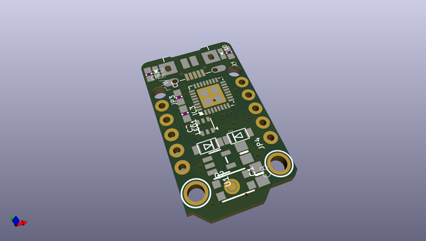
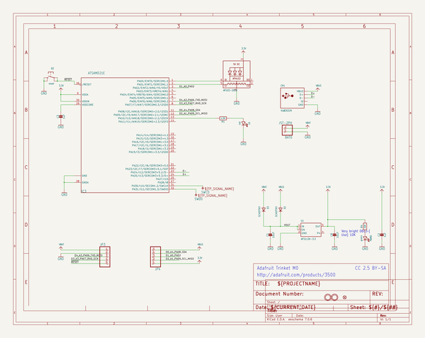
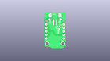
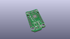
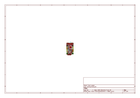
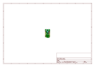
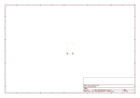
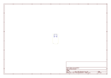
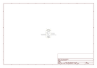

# OOMP Project  
## Adafruit-Trinket-M0-PCB  by adafruit  
  
(snippet of original readme)  
  
-- Adafruit Trinket M0 PCB  
  
<a href="http://www.adafruit.com/products/3500">   
Click here to purchase one from the Adafruit shop</a>  
  
This is the CAD & PCB data for the Adafruit Trinket M0. PCB format is EagleCAD schematic and board layout  
  
For more details, check out the product page at  
* https://www.adafruit.com/products/3500  
  
--- Description  
  
The Adafruit Trinket M0 may be small, but do not be fooled by its size! It's a tiny microcontroller board, built around the Atmel ATSAMD21, a little chip with a lot of power. We wanted to design a microcontroller board that was small enough to fit into any project, and low cost enough to use without hesitation. Perfect for when you don't want to give up your expensive dev-board and you aren't willing to take apart the project you worked so hard to design. It's our lowest-cost CircuitPython programmable board!  
  
We've taken the same form factor we used for the original ATtiny85-based Trinket and gave it an upgrade. The Trinket M0 has swapped out the lightweight ATtiny85 for a ATSAMD21E18 powerhouse. It's just as small, and it's easier to use, so you can do more.  
  
The most exciting part of the Trinket M0 is that while you can use it with the Arduino IDE, we are shipping it with CircuitPython on board. When you plug it in, it will show up as a very small disk drive with main.py on it. Edit main.py with your favorite text editor to build your project using Python, the most popular progr  
  full source readme at [readme_src.md](readme_src.md)  
  
source repo at: [https://github.com/adafruit/Adafruit-Trinket-M0-PCB](https://github.com/adafruit/Adafruit-Trinket-M0-PCB)  
## Board  
  
  
## Schematic  
  
  
  
[schematic pdf](working_schematic.pdf)  
## Images  
  
  
  
  
  
  
  
  
  
  
  
  
  
  
  
  
