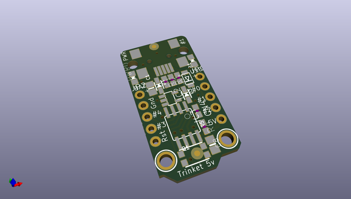
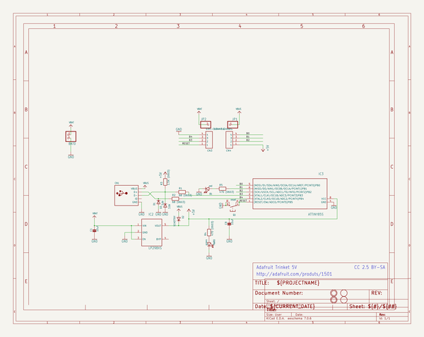
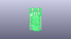
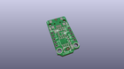
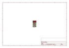
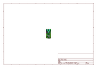
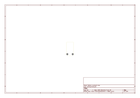
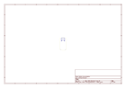
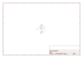

# OOMP Project  
## Adafruit-Trinket-PCB  by adafruit  
  
oomp key: oomp_projects_flat_adafruit_adafruit_trinket_pcb  
(snippet of original readme)  
  
-- Adafruit Trinket 3.3 and 5V Microcontroller PCBs  
&nbsp;   
   
Click to purchase from the Adafruit Shop:  
- [Adafruit Trinket - Mini Microcontroller - 3.3V Logic - MicroUSB](https://www.adafruit.com/product/1500)  
- [Adafruit Trinket - Mini Microcontroller - 5V Logic - MicroUSB](https://www.adafruit.com/product/1501)  
  
Deprecation Warning: The Trinket bit-bang USB technique it uses doesn't work as well as it did in 2014, many modern computers won't work well. So while we still carry the Trinket so that people can maintain some older projects, we no longer recommend it. Please check out the **Trinket M0**. It has built-in USB, more capabilities, and is comparable in price!  
  
Trinket may be small, but do not be fooled by its size! It's a tiny microcontroller board, built around the Atmel ATtiny85, a little chip with a lot of power. We wanted to design a microcontroller board that was small enough to fit into any project, and low cost enough to use without hesitation. Perfect for when you don't want to give up your expensive dev-board and you aren't willing to take apart the project you worked so hard to design. It's our lowest-cost arduino-IDE programmable board!  
  
This is the CAD & PCB data for the Adafruit Trinket 3V & 5V. The PCB format is EagleCAD schematic and board layout  
  
  full source readme at [readme_src.md](readme_src.md)  
  
source repo at: [https://github.com/adafruit/Adafruit-Trinket-PCB](https://github.com/adafruit/Adafruit-Trinket-PCB)  
## Board  
  
  
## Schematic  
  
  
  
[schematic pdf](working_schematic.pdf)  
## Images  
  
  
  
  
  
  
  
  
  
  
  
  
  
  
  
  
