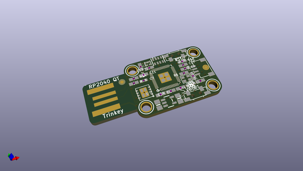
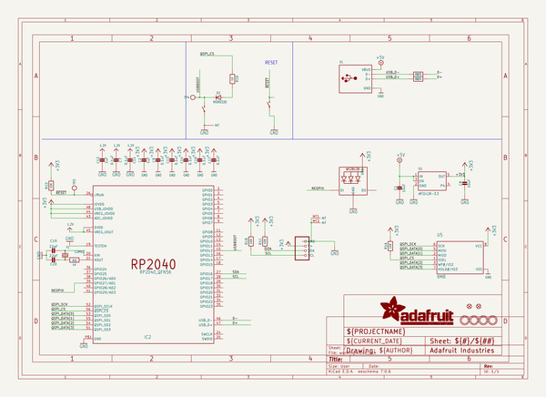
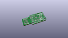
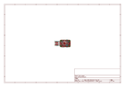
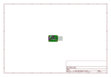
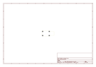
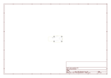
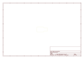
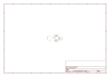

# OOMP Project  
## Adafruit-Trinkey-QT2040-PCB  by adafruit  
  
(snippet of original readme)  
  
-- Adafruit Trinkey QT2040 PCB  
  
<a href="http://www.adafruit.com/products/5056">   
Click here to purchase one from the Adafruit shop</a>  
  
PCB files for the Adafruit Trinkey QT2040.   
  
Format is EagleCAD schematic and board layout  
* https://www.adafruit.com/product/5056  
  
--- Description  
  
It's half USB Key, half Adafruit QT Py, and a lotta RP2040...it's Trinkey QT2040, the circuit board with an RP2040 heart and Stemma QT legs. Folks are loving the QT Py 2040 we made, but maybe you want something plug-and-play. So we thought, hey what if we made something like that plugs right into your computer's USB port? And this is what we came up with!  
  
The PCB is designed to slip into any USB A port on a computer or laptop. There's an RP2040 microcontroller on board with just enough circuitry to keep it happy. There's an RGB NeoPixel, a reset and bootloader or user button and a STEMMA QT Port on the end. That's it!  
  
With the body of the board being 1.0" x 0.7" and four mounting holes, you can attach just about any of our QT boards right on (some are a little larger so just check that has the holes in the same locations). Use M2.5 sized standoffs and screws to do so, you could use 2 diagonal at a minimum. Then use a shorty QT cable and you've got a custom sensor Trinkey for any sensor purpose.  
  
The board comes with 8 MB of QSPI flash memory so you can put all of our CircuitPython drivers on the disk!  
  
---- Plug-and-play STEMMA QT  
  
One of t  
  full source readme at [readme_src.md](readme_src.md)  
  
source repo at: [https://github.com/adafruit/Adafruit-Trinkey-QT2040-PCB](https://github.com/adafruit/Adafruit-Trinkey-QT2040-PCB)  
## Board  
  
  
## Schematic  
  
  
  
[schematic pdf](working_schematic.pdf)  
## Images  
  
  
  
  
  
  
  
  
  
  
  
  
  
  
  
  
