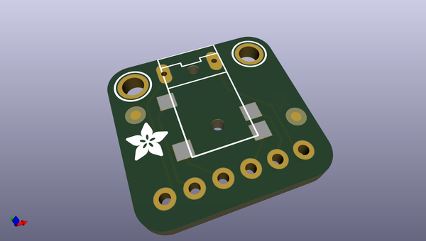
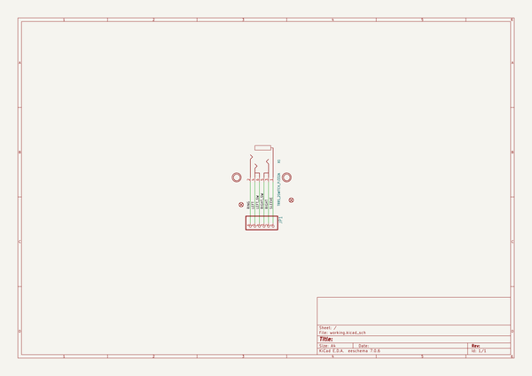
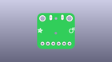
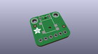
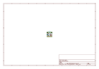
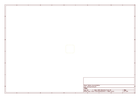
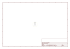

# OOMP Project  
## Adafruit-TRRS-Jack-Breakout-PCB  by adafruit  
  
oomp key: oomp_projects_flat_adafruit_adafruit_trrs_jack_breakout_pcb  
(snippet of original readme)  
  
-- Adafruit TRRS Jack Breakout PCB  
  
<a href="http://www.adafruit.com/products/5764">   
Click here to purchase one from the Adafruit shop</a>  
  
PCB files for the Adafruit TRRS Jack Breakout.   
  
Format is EagleCAD schematic and board layout  
* https://www.adafruit.com/product/5764  
  
--- Description  
  
Tip-Ring-Ring-Sleeve style audio cables are often used for situations where you want stereo audio and then an extra contact for a microphone input. For example, headsets for cell phones. Also called TRRS jacks for short, they're also handy if you happen to want to use common audio cables for low-speed data transmission with power, ground and two data lines.  
  
This breakout board is simple but has everything you need to interface with TRRS cables: not only do you get the four contacts but also two switched outputs:  
  
* When the jack is not inserted, the left switch is connected to the left contact and the right switch to the right contact.  
* When the jack is inserted, the left and right switch pins 'float'. You can use these switches to auto-switch from a built in speaker to headphone when plugged in, or to detect when headphone is not inserted to power down or mute.  
  
We like this jack in particular because it has two through-hole contacts near the opening for a good mechanical connection. Comes fully assembled on a breakout board with mounting holes and lil bit of header in case you want to use it with a breadboard.  
  
--- License  
  
Adafru  
  full source readme at [readme_src.md](readme_src.md)  
  
source repo at: [https://github.com/adafruit/Adafruit-TRRS-Jack-Breakout-PCB](https://github.com/adafruit/Adafruit-TRRS-Jack-Breakout-PCB)  
## Board  
  
  
## Schematic  
  
  
  
[schematic pdf](working_schematic.pdf)  
## Images  
  
  
  
  
  
  
  
  
  
  
  
  
  
  
  
  
