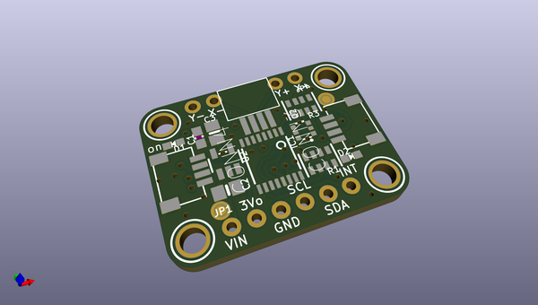
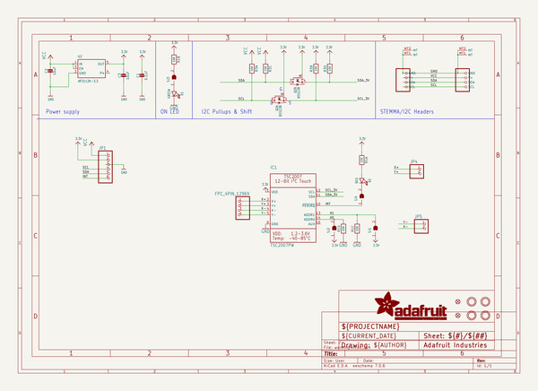
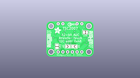
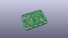
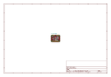
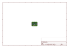
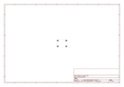
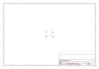
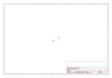
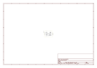

# OOMP Project  
## Adafruit-TSC2007-PCB  by adafruit  
  
(snippet of original readme)  
  
-- Adafruit TSC2007 I2C Resistive Touch Screen Controller PCB  
  
<a href="http://www.adafruit.com/products/5423">   
Click here to purchase one from the Adafruit shop</a>  
  
PCB files for the Adafruit TSC2007 I2C Resistive Touch Screen Controller.   
  
Format is EagleCAD schematic and board layout  
* https://www.adafruit.com/product/5423  
  
--- Description  
  
Getting touchy performance with your screen's touch screen? Resistive touch screens are incredibly popular as overlays to TFT and LCD displays. Only problem is they require a bunch of analog pins and you have to keep polling them since the overlays themselves are basically just big potentiometers. If your microcontroller doesn't have analog inputs, or maybe you want just a way more elegant controller, the TSC2007 is a nice way to solve that problem.  
  
--- License  
  
Adafruit invests time and resources providing this open source design, please support Adafruit and open-source hardware by purchasing products from [Adafruit](https://www.adafruit.com)!  
  
Designed by Limor Fried/Ladyada for Adafruit Industries.  
  
Creative Commons Attribution/Share-Alike, all text above must be included in any redistribution.   
See license.txt for additional details.  
  
  full source readme at [readme_src.md](readme_src.md)  
  
source repo at: [https://github.com/adafruit/Adafruit-TSC2007-PCB](https://github.com/adafruit/Adafruit-TSC2007-PCB)  
## Board  
  
  
## Schematic  
  
  
  
[schematic pdf](working_schematic.pdf)  
## Images  
  
  
  
  
  
  
  
  
  
  
  
  
  
  
  
  
