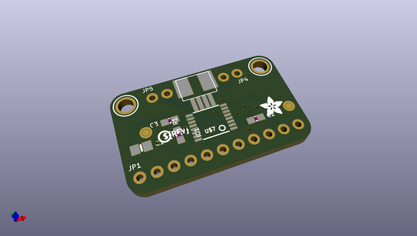
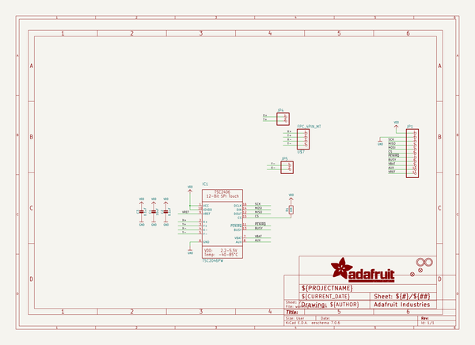

# OOMP Project  
## Adafruit-TSC2046-PCB  by adafruit  
  
(snippet of original readme)  
  
-- Adafruit TSC2046 SPI Resistive Touch Screen Controller PCB  
  
<a href="http://www.adafruit.com/products/5767">   
Click here to purchase one from the Adafruit shop</a>  
  
PCB files for the Adafruit TSC2046 SPI Resistive Touch Screen Controller.   
  
Format is EagleCAD schematic and board layout  
* https://www.adafruit.com/product/5767  
  
--- Description  
  
Getting touchy performance with your screen's touch screen? Resistive touch screens are incredibly popular as overlays to TFT and LCD displays. Only problem is they require a bunch of analog pins and you have to keep polling them since the overlays themselves are basically just big potentiometers. If your microcontroller doesn't have analog inputs, or maybe you want just a way more elegant controller, the TSC2046 is a nice way to solve that problem.  
  
This breakout board features the TSC2046, which has an easy-to-use SPI interface available. There is also an interrupt pin that you can use to indicate when a touch has been detected to your microcontroller or microcomputer. It can be powered from 3-5V, so it's safe to use with 3V or 5V logic. It's a nicely designed chip and has very stable precise readings. We found it's also a lot faster than trying to do all the readings on an Arduino.  
  
For the screens that have 1mm pitch FPC cables, you can plug the cable right into the connector. The majority of medium/large touchscreens have that kind of connector. If you have another kind of tou  
  full source readme at [readme_src.md](readme_src.md)  
  
source repo at: [https://github.com/adafruit/Adafruit-TSC2046-PCB](https://github.com/adafruit/Adafruit-TSC2046-PCB)  
## Board  
  
  
## Schematic  
  
  
  
[schematic pdf](working_schematic.pdf)  
## Images  
  
  
  
  
  
  
  
  
  
  
  
  
  
  
  
  
