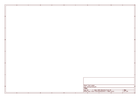

# OOMP Project  
## Adafruit-TXB0108-PCB  by adafruit  
  
(snippet of original readme)  
  
- PCB for the Adafruit TXB0108 breakout board  
  
<a href="http://www.adafruit.com/products/395"> Click here to purchase one from the Adafruit shop</a>  
  
__Format is EagleCAD schematic and board layout__  
  
Because the Arduino (and Basic Stamp) are 5V devices, and most modern sensors, displays, flash cards and modes are 3.3V-only, many makers find that they need to perform level shifting/conversion to protect the 3.3V device from 5V.  
  
Although one can use resistors to make a divider, for high speed transfers, the resistors can add a lot of slew and cause havoc that is tough to debug. For that reason, we like using 4050/74LVX245 series and similar logic to perform proper level shifting. Only problem is that they are only good in one direction which can be a problem for some specialty bi-diectional interfaces and also makes wiring a little hairy.  
  
That's where this lovely chip, the TXB0108 bi-directional level converter comes in! This chip perform bidirectional level shifting from pretty much any voltage to any voltage and will __auto-detect the direction__. Only thing that doesn't work well with this chip is i2c (because it uses strong pullups which confuse auto-direction sensor). If you need to use pullups, you can but they should be at least 50K ohm - the ones internal to AVRs/Arduino are about 100K ohm so those are OK! Its a little more luxurious than a 74LVX245 but if you just don't want to worry about directional pins this   
  full source readme at [readme_src.md](readme_src.md)  
  
source repo at: [https://github.com/adafruit/Adafruit-TXB0108-PCB](https://github.com/adafruit/Adafruit-TXB0108-PCB)  
## Board  
  
  
## Schematic  
  
  
  
[schematic pdf](working_schematic.pdf)  
## Images  
  
  
  
  
  
  
  
  
  
  
  
  
  
  
  
  
