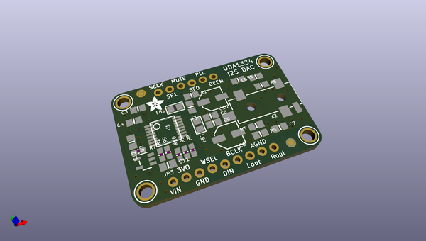
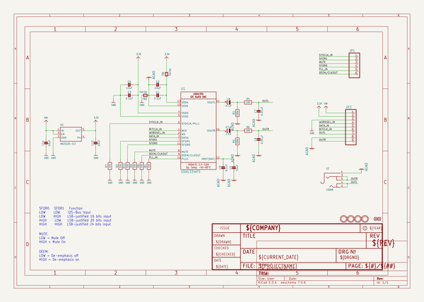
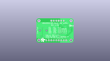
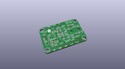
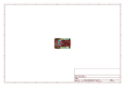
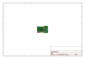
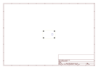
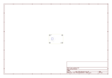
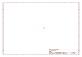
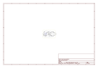

# OOMP Project  
## Adafruit-UDA1334A-I2S-Stereo-DAC-PCB  by adafruit  
  
oomp key: oomp_projects_flat_adafruit_adafruit_uda1334a_i2s_stereo_dac_pcb  
(snippet of original readme)  
  
-- Adafruit UDA1334A I2S Stereo DAC PCB  
  
<a href="http://www.adafruit.com/products/3678">   
Click here to purchase one from the Adafruit shop</a>  
  
PCB files for the Adafruit UDA1334A I2S Stereo DAC Breakout. Format is EagleCAD schematic and board layout  
  
For more details, check out the product page at  
* https://www.adafruit.com/products/3678  
  
--- Description  
  
This fully-featured UDA1334A I2S Stereo DAC breakout is a perfect match for any I2S-output audio interface. It's affordable but sounds great! The NXP UDA1334A is a jack-of-all-I2S-trades: you can use 3.3V - 5V logic levels (a rarity), and can process multiple different formats by setting two pins to high or low. The DAC will process data immediately, and give you a clear, analog, stereo line level output. It's even cool with MCLK-less I2S interfaces such as the Raspberry Pi (which it's ideal for) - a built in PLL will generate the proper clock from the bitclock signal.  
  
For inputs, you can use classic I2S (the default) or 16-bit, 20-bit or 24-bit left justified data. You can set it up to take an input system/master clock but we default-set it to just generate it for you, so you only need to connect Data In, Word Select (Left/Right Clock) and Bit Clock lines. If you want, there's a mute pin and a de-emphasis filter you can turn on.  
  
We put in plenty of ferrite beads, a low-dropout regulator, and the recommended band-pass filter so you get a very nice clean output. With  
  full source readme at [readme_src.md](readme_src.md)  
  
source repo at: [https://github.com/adafruit/Adafruit-UDA1334A-I2S-Stereo-DAC-PCB](https://github.com/adafruit/Adafruit-UDA1334A-I2S-Stereo-DAC-PCB)  
## Board  
  
  
## Schematic  
  
  
  
[schematic pdf](working_schematic.pdf)  
## Images  
  
  
  
  
  
  
  
  
  
  
  
  
  
  
  
  
