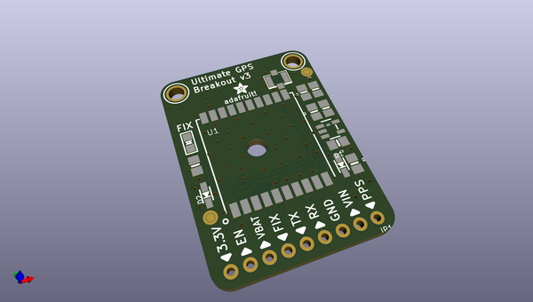
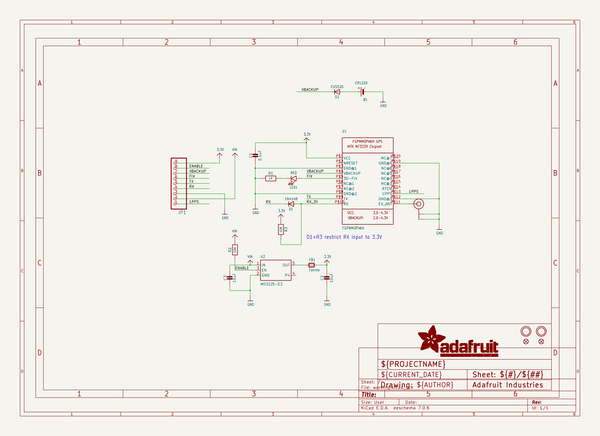
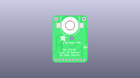
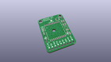
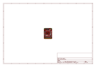
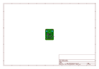
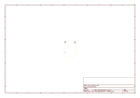
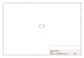
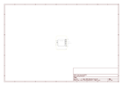

# OOMP Project  
## Adafruit-Ultimate-GPS  by adafruit  
  
(snippet of original readme)  
  
-- Adafruit Ultimate GPS PCB  
  
<a href="http://www.adafruit.com/products/4279">   
Click here to purchase one from the Adafruit shop</a>  
Other versions:  
* <a href="https://www.adafruit.com/product/746">Adafruit Ultimate GPS Breakout</a>  
* <a href="https://www.adafruit.com/product/3133">Adafruit Ultimate GPS FeatherWing</a>  
* <a href="https://www.adafruit.com/product/1272">Adafruit Ultimate GPS Logger Shield</a>  
* <a href="https://www.adafruit.com/product/2324">Adafruit Ultimate GPS HAT for Raspberry Pi</a>  
* <a href="https://www.adafruit.com/product/1059">Flora Wearable Ultimate GPS Module</a>  
  
PCB files for the Adafruit Ultimate GPS.   
  
Format is EagleCAD schematic and board layout  
* https://www.adafruit.com/product/4279  
* https://www.adafruit.com/product/746  
* https://www.adafruit.com/product/3133  
* https://www.adafruit.com/product/1272  
* https://www.adafruit.com/product/2324  
* https://www.adafruit.com/product/1059  
  
--- Description  
  
These boards are built around the MTK3339 chipset, a no-nonsense, high-quality GPS module that can track up to 22 satellites on 66 channels, has an excellent high-sensitivity receiver (-165 dBm tracking!), and a built-in antenna. It can do up to 10 location updates a second for high speed, high sensitivity logging, or tracking. Power usage is incredibly low, only 20 mA during navigation.  
  
We believe this is the Ultimate GPS module, so we named it that. It's got everything you want and more:  
  
* -1  
  full source readme at [readme_src.md](readme_src.md)  
  
source repo at: [https://github.com/adafruit/Adafruit-Ultimate-GPS](https://github.com/adafruit/Adafruit-Ultimate-GPS)  
## Board  
  
  
## Schematic  
  
  
  
[schematic pdf](working_schematic.pdf)  
## Images  
  
  
  
  
  
  
  
  
  
  
  
  
  
  
  
  
