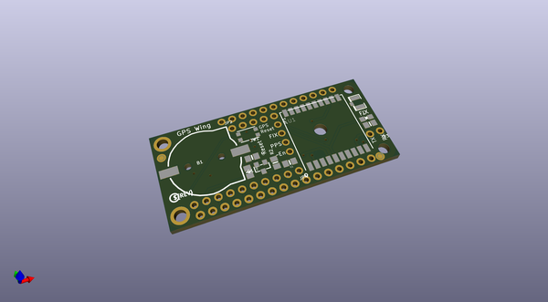
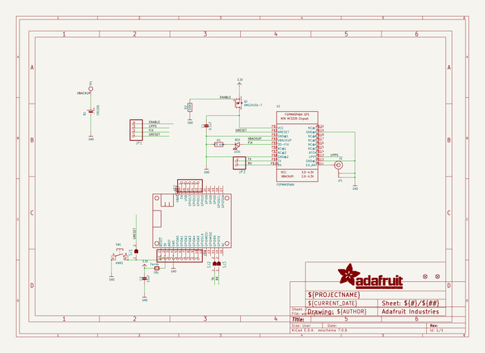
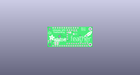
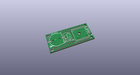
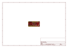
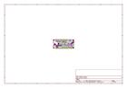
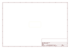
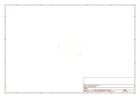
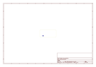
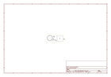

# OOMP Project  
## Adafruit-Ultimate-GPS-FeatherWing-PCB  by adafruit  
  
(snippet of original readme)  
  
-- Adafruit Ultimate GPS FeatherWing PCB  
<a href="http://www.adafruit.com/products/3133">   
Click here to purchase one from the Adafruit shop</a>  
  
The Adafruit Ultimate GPS FeatherWing plugs right into your Feather board and gives it a precise, sensitive, and low power GPS module for location identifcation anywhere in the world. As a bonus, the GPS can also keep track of time once it is synced with the satellites.  
  
Works with all Feathers except for those with USB-Serial converters that use the UART pins. Right now that means the ESP8266 Huzzah Feather and nRF52 Feather don't work  
  
PCB files for the Adafruit Ultimate GPS FeatherWing. The format is EagleCAD schematic and board layout  
- https://www.adafruit.com/products/3133  
  
--- License  
  
Adafruit invests time and resources providing this open source design, please support Adafruit and open-source hardware by purchasing products from [Adafruit](https://www.adafruit.com)!  
  
All text above must be included in any redistribution  
  
Designed by Limor Fried/Ladyada for Adafruit Industries.  
Creative Commons Attribution/Share-Alike, all text above must be included in any redistribution.   
See license.txt for additional information.  
  
  full source readme at [readme_src.md](readme_src.md)  
  
source repo at: [https://github.com/adafruit/Adafruit-Ultimate-GPS-FeatherWing-PCB](https://github.com/adafruit/Adafruit-Ultimate-GPS-FeatherWing-PCB)  
## Board  
  
  
## Schematic  
  
  
  
[schematic pdf](working_schematic.pdf)  
## Images  
  
  
  
  
  
  
  
  
  
  
  
  
  
  
  
  
