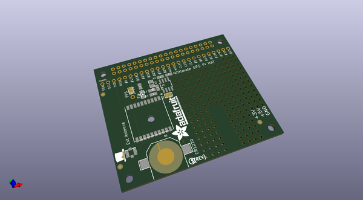
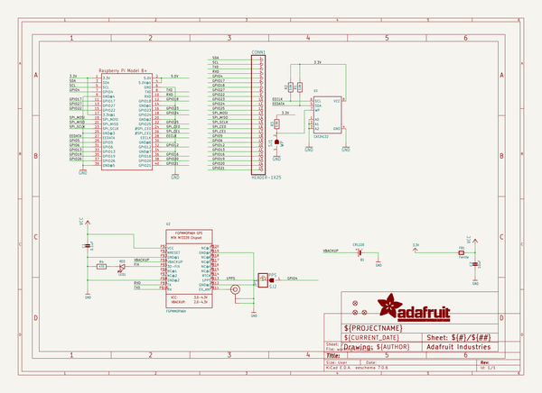
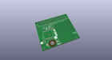
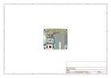
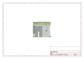
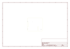
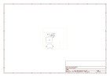

# OOMP Project  
## Adafruit-Ultimate-GPS-HAT-PCB  by adafruit  
  
(snippet of original readme)  
  
-- Adafruit Ultimate GPS HAT PCB  
  
<a href="http://www.adafruit.com/products/2324">   
Click here to purchase one from the Adafruit shop  
</a>  
  
PCB files for the Adafruit Ultimate GPS HAT. Format is EagleCAD schematic and board layout  
- http://www.adafruit.com/product/2324  
  
This new HAT from Adafruit adds our celebrated Ultimate GPS on it, so you can add precision time and location to your Raspberry Pi Model Pi 3, Pi Zero, A+, B+, or Pi 2 & 3  
  
Here's the low-down on the GPS module:  
  
-165 dBm sensitivity, 10 Hz updates, 66 channels  
Only 20mA current draw  
Built in Real Time Clock (RTC) - slot in a CR1220 backup battery for 7-years or more of timekeeping even if the Raspberry Pi is off!  
PPS output on fix, by default connected to pin -4  
Internal patch antenna which works quite well when used outdoors + u.FL connector for external active antenna for when used indoors or in locations without a clear sky view  
Fix status LED blinks to let you know when the GPS has determined the current coordinates  
We spun up a HAT based on our Ultimate GPS, added a coin-cell holder for RTC usage, break-outs for all the Raspberry Pi's extra pins, and plenty of prototyping area for adding LEDs, sensors, and more.  
  
Please note, this HAT takes over the Raspberry Pi's hardware UART to send/receive data to and from the GPS module. So, if you need to use the RX/TX pins with a console cable, you cannot also use this HAT. Instead, you'll have to use a compos  
  full source readme at [readme_src.md](readme_src.md)  
  
source repo at: [https://github.com/adafruit/Adafruit-Ultimate-GPS-HAT-PCB](https://github.com/adafruit/Adafruit-Ultimate-GPS-HAT-PCB)  
## Board  
  
  
## Schematic  
  
  
  
[schematic pdf](working_schematic.pdf)  
## Images  
  
  
  
  
  
  
  
  
  
  
  
  
  
  
  
  
