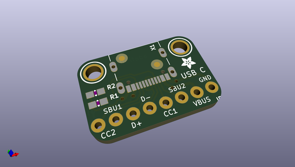
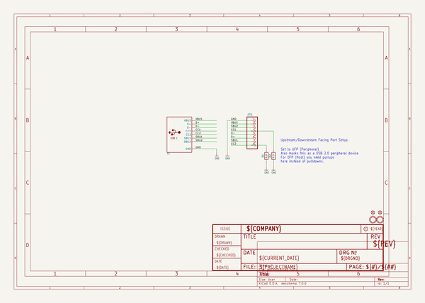
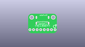
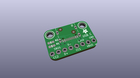
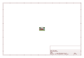
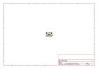
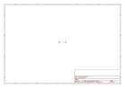
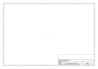
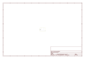

# OOMP Project  
## Adafruit-USB-C-Downstream-Breakout  by adafruit  
  
oomp key: oomp_projects_flat_adafruit_adafruit_usb_c_downstream_breakout  
(snippet of original readme)  
  
-- Adafruit USB C Breakout Board - Downstream Connection PCB  
  
<a href="http://www.adafruit.com/products/4090">   
Click here to purchase one from the Adafruit shop</a>  
  
PCB files for the Adafruit USB C Breakout Board - Downstream Connection. Format is EagleCAD schematic and board layout  
* https://www.adafruit.com/product/4090  
  
--- Description  
  
Throw out all those Mini and Micro B USB cables you have in a plastic bin - the next generation of USB connectors is here with **USB C!** You will start to see these connectors pop up on all sorts of devices, as the industry moves from micro B or lightening to the new standard. Well, at least until the next standard comes out  
  
USB C features a symmetric/reversible connector, more data pins and higher current output capability. But, for most developers, the pin usage you know and love from older USB will work just fine. This breakout gives you all the basics you need and a resistor configuration that mimics classic USB 2.0 for a downstream connection  
  
The two 5.1K resistors on the **CC1** pins indicate to the upstream port to provide 5V and up to 1.5A (whether the upstream can supply that much current depends on what you're connecting to.  
  
For most usages, you can just connect **VBUS** to your 5V input, **GND** to ground, and **D+** and **D-** as you expect. You can monitor the CC and SBU pins to determine cable polarity, or send side-band data. Or leave them disconnected  
  
[For more det  
  full source readme at [readme_src.md](readme_src.md)  
  
source repo at: [https://github.com/adafruit/Adafruit-USB-C-Downstream-Breakout](https://github.com/adafruit/Adafruit-USB-C-Downstream-Breakout)  
## Board  
  
  
## Schematic  
  
  
  
[schematic pdf](working_schematic.pdf)  
## Images  
  
  
  
  
  
  
  
  
  
  
  
  
  
  
  
  
