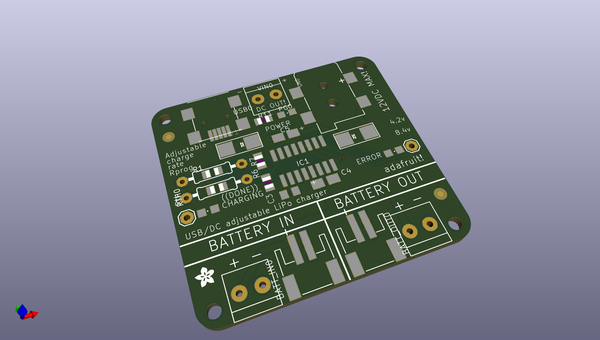
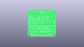
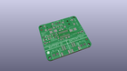
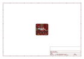
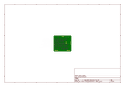
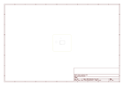
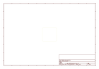
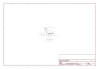

# OOMP Project  
## Adafruit-USB-DC-LiPoly-Charger  by adafruit  
  
(snippet of original readme)  
  
- PCB for the Adafruit USB/DC Lithium Ion/Polymer charger  
  
  
  
This is the PCB for the Adafruit USB/DC Lithium Ion/Polymer charger  
__Format is EagleCAD schematic and board layout__  
  
Charge your single-cell lithium ion/polymer battery any which way you like with this board. Have a USB connection? No problem, just plug into the miniUSB connector. Only have a wall adapter? Any standard 2.1mm DC adapter which puts out 5 to 12VDC will work fine. If both are plugged in, the charger will automatically choose whichever has the highest voltage.  
  
Other nice things about this charger include multiple LEDs for power & charging status, including a charging LED which will blink when the battery is full. If the charger gets too hot from high-speed charging, it will slow down the charge rate automatically. You can easily adjust the charge rate up to 1.2A or down to 100mA.  
  
For use with Adafruit Lipoly/LiIon batteries only! Other batteries may have different voltage, chemistry, polarity or pinout.  
  
- Use USB or DC power - 5 to 12V input  
- Charges one single-cell 3.7/4.2v batteries (not for older 3.6/4.1v cells) with constant current/constant voltage  
- Three indicator LEDs - green for Power, orange for charging and red for error  
- Charging LED will blink when the battery is full  
- You don't have to worry about heat dissipation in the charger, even when plugging in a 12V DC power jack - thermal p  
  full source readme at [readme_src.md](readme_src.md)  
  
source repo at: [https://github.com/adafruit/Adafruit-USB-DC-LiPoly-Charger](https://github.com/adafruit/Adafruit-USB-DC-LiPoly-Charger)  
## Board  
  
  
## Schematic  
  
  
  
[schematic pdf](working_schematic.pdf)  
## Images  
  
  
  
  
  
  
  
  
  
  
  
  
  
  
  
  
