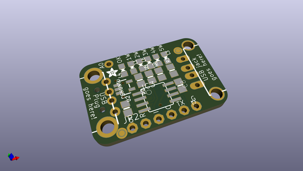
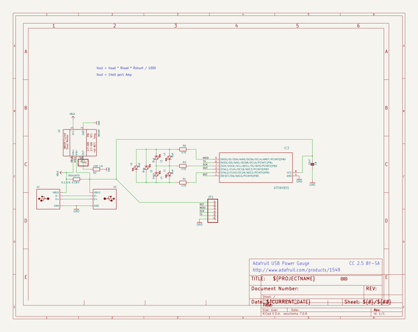
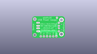
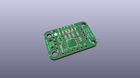
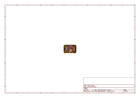
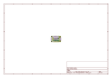
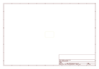
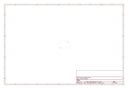
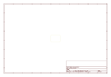
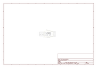

# OOMP Project  
## Adafruit-USB-Power-Gauge-PCB  by adafruit  
  
oomp key: oomp_projects_flat_adafruit_adafruit_usb_power_gauge_pcb  
(snippet of original readme)  
  
-- Adafruit USB Power Gauge PCB (Discontinued)  
  
  
  
PCB files for the Adafruit USB Power Gauge. Format is EagleCAD schematic and board layout  
* https://www.adafruit.com/product/1549  
  
--- Description  
  
**This product is currently discontinued.** - This little USB port go-between is like a speed gauge for your USB devices. Instead of hauling out a multimeter and splicing cables, plug this in between for a quick reading on how much current is being drawn from the port. Great for seeing the charge rate of your phone or tablet, checking your battery chargers, or other USB powered projects.  
  
There are a few USB power meters out there, The Practical Meter and the USB Spypow. We wanted something that was made for makers: Reprogrammable micro-controller, analog output, TTL serial output for debugging / datalogging and of course, open source.  
  
Data is passed through transparently from end to end, so you can use it with any USB device at any speed. The power line has a 0.1 ohm current sense resistor and an INA169 high-side current sensor that is tracked by a little ATtiny85 chip. The microcontroller is programmed to read the current draw as well as the bus voltage and light up the strip of LEDs on the side.  
  
The blue LEDs will light up, one for each Watt of power draw (which is ~200mA at 5V nominal), with a couple levels of PWM dimming for increasing current. You can measure up to 1A of current draw - most USB ports are rated for 500mA. It  
  full source readme at [readme_src.md](readme_src.md)  
  
source repo at: [https://github.com/adafruit/Adafruit-USB-Power-Gauge-PCB](https://github.com/adafruit/Adafruit-USB-Power-Gauge-PCB)  
## Board  
  
  
## Schematic  
  
  
  
[schematic pdf](working_schematic.pdf)  
## Images  
  
  
  
  
  
  
  
  
  
  
  
  
  
  
  
  
