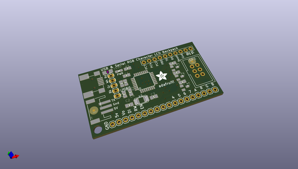
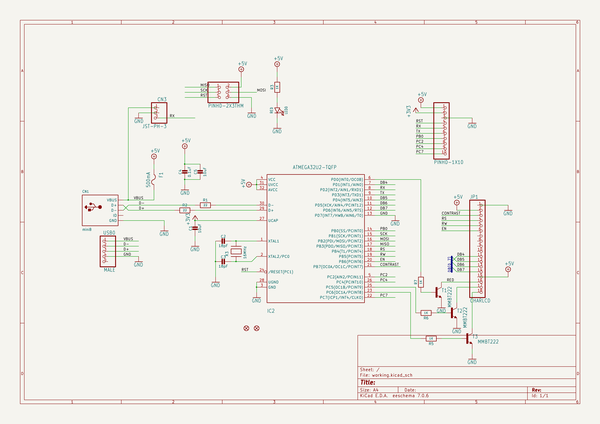
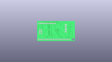
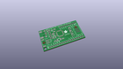
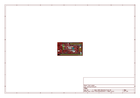
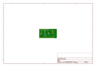
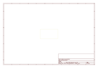
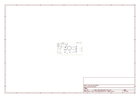

# OOMP Project  
## Adafruit-USB-Serial-RGB-Character-Backpack-PCB  by adafruit  
  
oomp key: oomp_projects_flat_adafruit_adafruit_usb_serial_rgb_character_backpack_pcb  
(snippet of original readme)  
  
-- Adafruit USB Serial RGB Character Backpack PCB  
&nbsp;   
   
Click the image or links below to go to a specific product in the Adafruit shop.  
  
PCB files for the Adafruit USB Serial RGB Character Backpack. Format is EagleCAD schematic and board layout  
- Positive Backlight https://www.adafruit.com/product/782  
- Negative Backlight https://www.adafruit.com/product/784  
  
--- DESCRIPTION  
Adding a character display to your project or computer has never been easier with the new Adafruit USB or TTL serial backpack! This custom-designed PCB sits on the back of our 'standard' character LCD (16x2 or 20x4 sized) and does everything you could want: printing text, automatic scrolling, setting the backlight, adjusting contrast, making custom characters, turning on and off the cursor, etc. It can even handle our RGB backlight LCDs with full 8-bit PWM control of the backlight. That means you can change the background color to anything you want - red, green, blue, pink, white, purple yellow, teal, salmon, chartreuse, or just leave it off for a neutral background.  
  
Inside the backpack is an USB-capable AT90USB162 chip that listens for commands both a mini-B USB port and a TTL serial input wire. The USB interface shows up as a COM/serial port on Windows/Mac/Linux. The backpack will automatically se  
  full source readme at [readme_src.md](readme_src.md)  
  
source repo at: [https://github.com/adafruit/Adafruit-USB-Serial-RGB-Character-Backpack-PCB](https://github.com/adafruit/Adafruit-USB-Serial-RGB-Character-Backpack-PCB)  
## Board  
  
  
## Schematic  
  
  
  
[schematic pdf](working_schematic.pdf)  
## Images  
  
  
  
  
  
  
  
  
  
  
  
  
  
  
  
  
