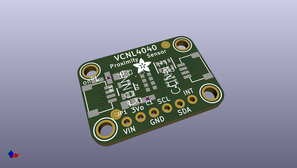
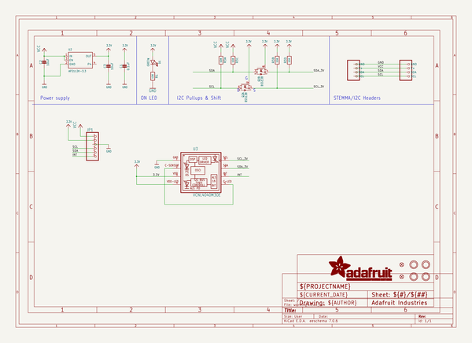
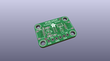
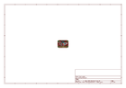
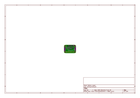
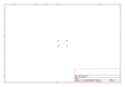
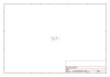

# OOMP Project  
## Adafruit-VCNL4040-PCB  by adafruit  
  
(snippet of original readme)  
  
-- Adafruit VCNL4040 Proximity and Lux Sensor PCB  
  
<a href="http://www.adafruit.com/products/4161">   
Click here to purchase one from the Adafruit shop</a>  
  
PCB files for the Adafruit VCNL4040 Proximity and Lux Sensor.   
  
Format is EagleCAD schematic and board layout  
* https://www.adafruit.com/product/4161  
  
--- Description  
  
The VCNL4040 is a handy two-in-one sensor, with a proximity sensor that works from 0 to 200mm (about 7.5 inches) and light sensor with range of 0.0125 to 6553 lux.  
  
We've all been there. That thing is _close_ but _how close?_ When you need to measure a small distance with reasonable accuracy, such as the rough height of particularly calm bumble bee, the VCNL4040 Proximity Sensor from Vishay can do that for you. If perchance you also needed to measure the amount of light at the same time, perhaps to let the bee to know if it's time for bed, you're in luck! The VCNL4040 can do that too (bumble bee not included, we tried putting it in the anti-static bag but it started buzzing in a threatening manner)  
  
"OK, _finally_ I can get started on my bee measuring and light sensing project, but _how do I use it_?" you say. To make life easier so you can focus on your important work, we've taken the VCNL4040 and put it onto a breakout PCB along with support circuitry to let you use this little wonder with 3.3V (Feather/Raspberry Pi) or 5V (Arduino/ Metro328) logic levels. Additionally since it speaks I2C you can easily  
  full source readme at [readme_src.md](readme_src.md)  
  
source repo at: [https://github.com/adafruit/Adafruit-VCNL4040-PCB](https://github.com/adafruit/Adafruit-VCNL4040-PCB)  
## Board  
  
  
## Schematic  
  
  
  
[schematic pdf](working_schematic.pdf)  
## Images  
  
  
  
  
  
  
  
  
  
  
  
  
  
  
  
  
